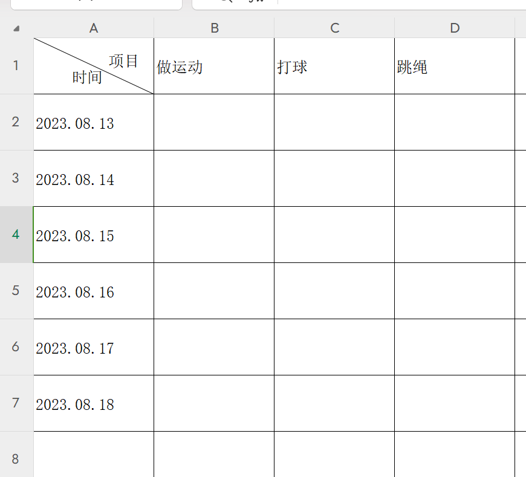
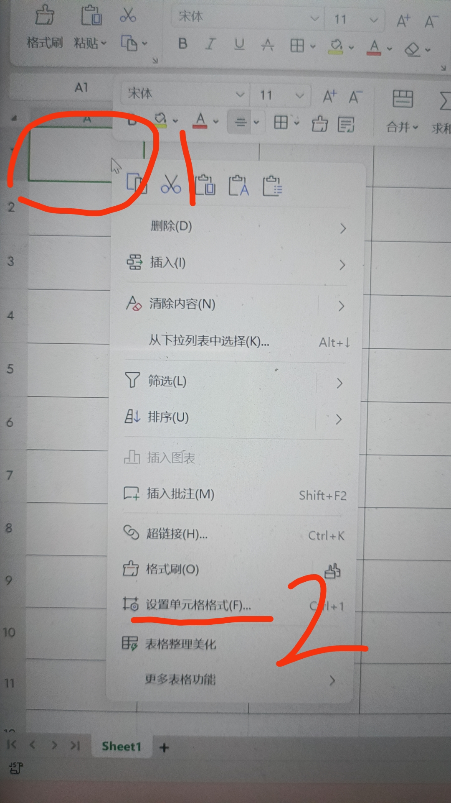
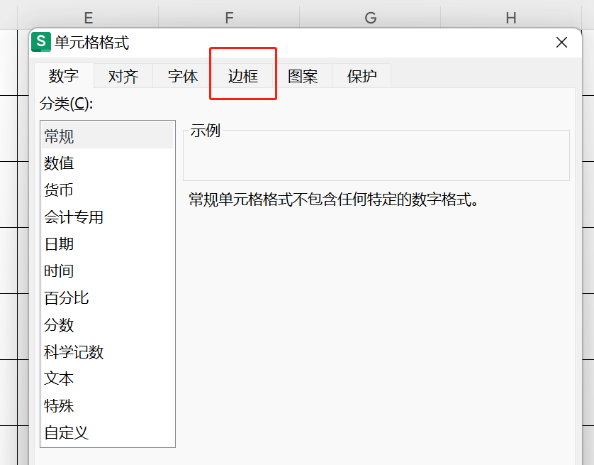
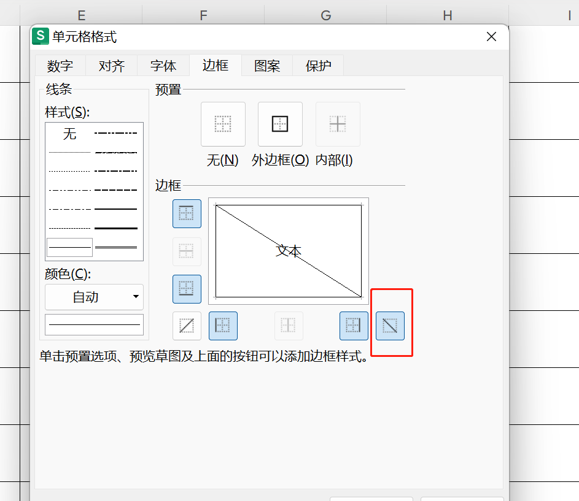
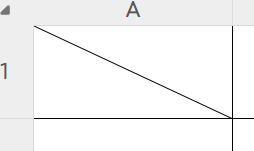
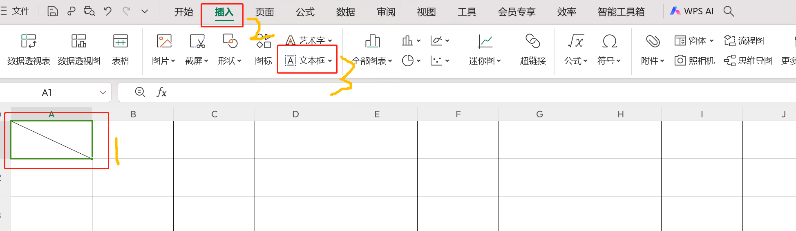
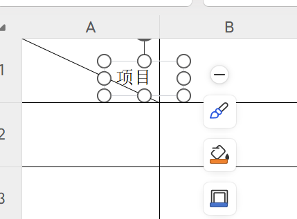

### 实现目标

有时候使用Excel表格时，行和列代表不同内容，左上角方格是对行和列的说明，会用到**斜线加文字**的效果，示例如下

### 如何实现

第一步先画出斜线，第二步编写文字。

### 实现步骤

#### 第一步 划线

选中单个单元格，右击-选择设置单元格格式-选择边框-再选择斜线（见图片）- 最后点击确定

#### 第二步 写字

在选择当前单元格的前提下 - 选择最顶部的插入菜单 - 选择文本框

紧接着选择文本框后 - 再适当的位置右击插入并写入文字 - 适当调整位置

最后结果

