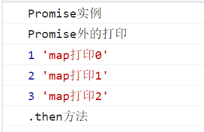
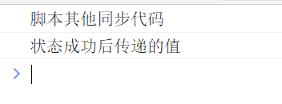

## 1. Promise是什么

Promise简单来说就是一个容器，里面保存着未来才会结束的事件的结果（这个事件就是异步操作）。Promise是一个对象（构造函数），可以获取异步操作的结果。

**特点：**

- 对象的状态不受外界影响。有三种状态分别是Pending(进行中)、Fulfilled(已成功)、Rejected(已失败)，这三种状态只能是异步的结果决定，其他操作都不能改变。

- 状态改变后不会再变，任何时候都可以得到这个结果。状态改变只有两种情况分别是进行中变成成功、进行中变成失败。就是算已经发生变化，再对Promise添加回调函数
也会立即得到这个结果，而事件（event）则是错过了监听就得不到结果了。


## 2. 为什么会出现Promise

因为之前解决异步操作使用回调函数，会嵌套多层，影响编写阅读，而Promise的出现更容易实现，使异步操作可以看出同步操作，阅读更容易。

## 3. Promise基本用法

```js
const promise = new Promise((resolve, reject) => {
    if (/* 异步操作成功*/) {
        resolve(value)
    } else {
        reject(value)
    }
})
```

Promise构造函数接受一个函数作为参数，这个函数有两个参数分别是`resolve`、`reject`,这两个参数也是函数。

`resolve`的作用就是将Promise对象的状态从`进行中`变为`成功`,在异步操作成功时进行调用，并将异步操作的结果作为参数传递出去。

`reject`的作用就是将Promise对象的状态从`进行中`变为`失败`,在异步操作失败时进行调用，并将异步操作的错误结果作为参数传递出去。

### 1. then回调函数

当Promise实例生成后可以使用then方法分别指定`resolved`和`rejected`状态的回调函数

`then`方法接受两个回调函数作为参数，第一个参数是Promise对象状态变为resolved时调用，第二个参数是Promise对象状态变为rejected时调用，其中第二个参数是可选的，
**这两个函数的参数都是Promise对象传过的值当作为参数**。

```js
promise.then((value) => {
    // 成功执行的代码
}, (error) => {
    // 失败执行的代码
})
```

### 2. then方法执行顺序

Promise对象建立后会立即执行，**但是`then`方法指定的回调函数会在当前脚本所有同步任务执行完成后才会执行**。通俗讲比如说现在处在一个方法中，then后还有代码，
比如正常的代码或者异步代码，它执行时会自动在正常代码（同步）后面执行。


```js
const promise = () => {
    new Promise((resolve, reject) => {
        console.log('Promise实例')
        resolve('hello')
    }).then(result => {
        console.log('.then方法')
    })
    console.log('Promise外的打印');
    const list = [1, 2, 3];
    list.map((item, index) => {
        console.log(item, 'map打印' + index);
    })
}
promise();

```


### 3. resolve、reject函数的参数

reject函数的参数通常是Error对象的实例，表示抛出的错误。

resolve函数的参数除了正常值外，可以是Promise实例，如果是Promise实例则需要特别的注意。

如果传入的是一个实例p2，则本实例p1的状态取决于传入p2的状态，假如p1将要变成成功的状态，而传入的p2则为失败状态，则p1会执行失败状态时的代码。p1会等待p2实例的状态转变。

```js
const p2 = new Promise((resolve, reject) => {
    reject(new Error('fail'));
})

const p1 = new Promise((resolve, reject) => {
    resolve(p2);
})

p1.then((result) => {
    console.log(result);
}).catch((error) => {
    console.log(error);
})
// 打印结果为：Error: fail
```
p2实例返回一个失败，本来p1是返回成功的，执行then方法，然后传入的参数是p2,而p2是一个实例，则此时的状态由p2决定，因此执行的是catch方法。

### 4. resolve 代码执行顺序

resolve函数所处脚本位置代码执行顺序和then方法一样，**都是在本轮事件循环的末尾执行，总是晚于本脚本的同步任务。**

```js
const resolve = () => {
    new Promise((resolve, reject) => {
        resolve('状态成功后传递的值');
        console.log('脚本其他同步代码');
    }).then((result) => {
        console.log(result);
    })
}
resolve();
```



从上面的代码可以看出，resolve函数后面的代码先执行了。

其实按正常来说resolve返回了成功时传递的信息，Promise也就完成了自己的使命，后面就不应该再有代码出现了，因此当书写代码时应该写在最后，或者可以使用
`return`语句，这样不会产生意外。

```js
new Promise((resolve, reject) => {
    return resolve(1);
    // 这样后面的语句不会执行
    console.log(2);
})
```


## 4. Promise.all()

Promise.all方法就是将多个Promise实例包装成一个新的Promise实例。

```js
const p = Promise.all([p1, p2, p3]);
```
**要求：**

参数是一个数组形式，且每一项必须为Promise实例，假如不是实例则会调用Promise.resolve转化成Promise实例。

#### 1. 新实例的状态

p的状态由参数的状态决定，分为两种情况。

第一种：所有的参数状态都变成Fulfilled（成功），则新实例变成Fulfilled，所有参数的返回值会组成一个数组，传递给新实例的回调函数。

第二种：如果有一个参数的状态变为Rejected（失败），则实例会变成Rejected，则会把这个结果传递给新实例的回调函数。

#### 2. 参数实例是否有catch方法

> **如果作为参数的Promise实例自定义了catch方法，那么它被rejected时并不会触发Promise.all()的catch方法**

这是为什么？？？

因为假如参数实例有catch方法时，执行完catch方法会返回一个新的Promise实例，此时的参数实例就会变为新返回的实例，
会变成resolved状态，会将catch方法执行完返回的值传递给all方法的回调函数。

```js
// 参数p2有catch方法，最终结果为 ["hello", Error: 报错了]
const p1 = new Promise((resolve, reject) => {
        resolve('hello')
    }).then(result => result)
        .catch(e => e);

    const p2 = new Promise((resolve, reject) => {
        throw new Error('报错了');
    }).then(result => result)
        .catch(e => e);

    Promise.all([p1, p2])
        .then(result => console.log(result))  // ["hello", Error: 报错了]
        .catch(e => console.log(e));
```

```js

// 参数p2没有catch方法，会执行all的catch方法，输出Error: 报错了
const p1 = new Promise((resolve, reject) => {
    resolve('hello')
}).then(result => result)
    .catch(e => e);

const p2 = new Promise((resolve, reject) => {
    throw new Error('报错了');
}).then(result => result)

Promise.all([p1, p2])
    .then(result => console.log(result))
    .catch(e => console.log(e)); // Error: 报错了
```


