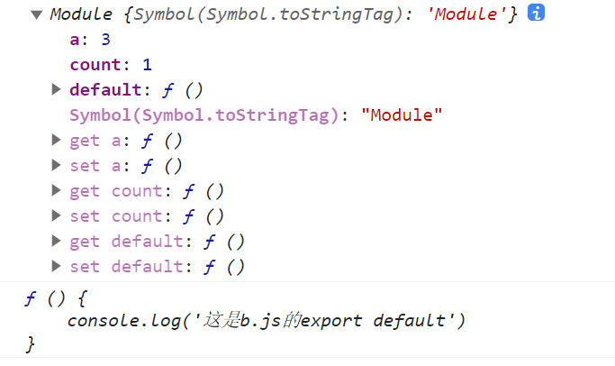

一个模块就是一个独立的文件，这个文件中的所有变量，只能在文件内部使用，假如想在外部使用，则必须先导出，然后在使用的文件中进行导入
才能使用。

在讲ES6中的导入导出之前，需要我们知道的是之前JavaScript并没有真正意义的模块化。之前社区指定了一些模块化方案，分别是commonJS和AMD两种，
而ES6引入的导入与导出完全可以替代之前的。

## 1. 设计思想 - 静态化

这样的好处就是在编译的时候就能确定模块的依赖关系，而不是等到运行的时候。commonJS和AMD就是运行的时候
才能知道那些会用到那些不会被用到，这样效率会变低。

```js
// CommonJS模块
let { stat, exists, readfile } = require('fs');

// 等同于
let _fs = require('fs');
let stat = _fs.stat;
let exists = _fs.exists;
let readfile = _fs.readfile;
```
在commonJS中，它会加载这个模块中所有的方法，生成一个大对象，然后找到你要使用的那个，**假如这个模块中有十个方法，
而你只需要使用其中一个，那么他也会把这十个加载出来**。

```js
// ES6模块
import { stat, exists, readFile } from 'fs';
```
而ES6中，使用哪个方法就是那个方法，即使这个模块中有多个，**也只是导出的是你要使用的那个，多余的不会导出**。

## 2. export 导出

使用`export`定义模块的导出、对外接口。

### 写法1

```js
// profile.js
export var firstName = 'Michael';
export var lastName = 'Jackson';
export var year = 1958;
```

### 写法2

```js
// profile.js
var firstName = 'Michael';
var lastName = 'Jackson';
var year = 1958;

export { firstName, lastName, year };
```

这样就能对外导出模块中的内容了

优先选择第二种方法，因为这样可以把所有的对外接口，写在一起，看起来容易。

除了可以导出**变量**，还可以**导出函数、类(class)**

### 注意点

需要记住的是`export`定义对外的接口，**必须和模块中的变量建立一一对应的关系，切记不能导出一个变量的值**。

```js
// 报错
export 1;

// 报错
var m = 1;
export m;
```
以上两种情况都是错误的，因为导出的是一个值，而并非是变量。

正确写法

```js
// 写法一
export var m = 1;

// 写法二
var m = 1;
export {m};

```

### 重命名

一般情况导出的名称就是模块内部声明的名称，假如还是想另外起一个名称则可以用关键字`as`

```js
function v1() { ... }
function v2() { ... }

export {
  v1 as streamV1,
  v2 as streamV2,
  v2 as streamLatestVersion
};
```
上面含义为将函数`v1`重命名为`streamV1`,然后再导出。也可以将同一个方法，重命名多次都是允许的。

## 3. import 导入

使用`import`导入需要使用的模块

### 使用方法

```js
// main.js
import { firstName, lastName, year } from './profile.js';

function setName(element) {
  element.textContent = firstName + ' ' + lastName;
}
```

`import`后接一个大括号，里面指定要导入的变量名，这个变量名必须和导出的变量名一致，

后面`from`导入的模块路径，可以是相对路径， 也可以是绝对路径。如果不带有路径，只是一个模块名，那么必须有配置文件，告诉 JavaScript 引擎该模块的位置。

### 重命名

如果不想使用导出的变量名，可以将变量名重新命名。使用关键字`as`，as前面为重命名之前的名称，后面为重命名后的名称

```js
// main.js
import { firstName as name } from './profile.js';
console.log(name);
```

### 只读

对于导入的变量名，不能修改，修改会报错，

但是如果导入的变量名为对象的话，可以修改，修改后也可以在其他文件中导入使用，但是不建议这样，维护起来会很麻烦。

### 提升，默认为模块的顶部

```js
foo();

import { foo } from 'my_module';
```
这样的导入与使用是没有问题的，引入ES6大导入导出是在运行的时候执行的，所以这里的**导入**会先执行，
而`foo()`要等到编译的时候才执行，会晚于导入。

### 整体导入加载

就是除了一个个加载某个值外，还可以一次性加载所有的，使用关键词`*`指定一个对象，将所有的导入都指定在这个对象上。

之前的：加载三个需要将这三个都写出来
```js
// main.js
import { firstName, lastName, year } from './profile.js';
```

现在，整体加载后，可以使用x.x形式使用

```js
// main.js
import * as obj from './profile.js';
console.log(obj.firstName, obj.lastName, obj.year)
```

## 4. export default 导出

`export default`其实是为了解决`export`导出时的不足，当使用`export`时会发现，导入时的名称要跟导出时的一样，
这样就会造成，必须知道导出时的名称，假如不清楚就不能使用。

而`export default` 正好解决了这个不足，`export default`是默认导出，导出后是一个对象大集合，导入时可以随便命名，使用方法x.x

### 使用方法


```js
// export-default.js
export default function () {
  console.log('foo');
}
```
在`export-default.js`文件中导出一个函数

```js
// import-default.js
import customName from './export-default';
customName(); // 'foo'
```
导入时，可以随便命名，**注意点：这是import后不用加大括号**


### 重点export default和export区别

`export default`用于指定模块的默认输出，一个模块只能使用`export default`**一次**，**并且对应的`import`不用大括号**

说通俗一点 `export`输出是`export + 咱们自己命名的变量名或方法名`，也就是为什么使用`export`导出时不能导出一个值，必须是
和变量要一一对应。**不能导出值必须是名称**

而`export default`就是输出了一个叫做`default`的变量或方法，只不过这个名称给咱们提前声明好了。也正因为有了这个变量名(**default**)，
所以在导出时后不能跟变量声明语句。**可以导出值但不能是名称**


```js
// 正确
export var a = 1;

// 正确
var a = 1;
export default a;

// 错误
export default var a = 1;
```

```js
// 正确
export default 42;

// 报错
export 42;
```
**`export`在一个模块中可以使用多次，而`export default`只能使用一次。**


根据关键字`as`改名称可以得到以下两种写法都是正确的。

```js
// modules.js
function add(x, y) {
  return x * y;
}
export { add as default };
// 等同于
// export default add;

// app.js
import { default as foo } from 'modules';
// 等同于
// import foo from 'modules';
```

### 默认导入和个别导入

```js
import _, { each, forEach } from 'lodash';
```
这里默认导入为一个名称为`_`的，并且部分导入了`each`和`forEach`模块

## 5. export 与 import 的复合写法 

意思就是在一个模块中，先导入一个模块，然后再把这个模块再导出，可以先一个简单的语句。

正常的语句：

```js
// 导出
export { foo, bar }
// 导入
import { foo, bar} from 'my_module';
```
简写之后：

```js
export { foo, bar } from 'my_module'
```

## 6. 继承

就是模块中可以继承其他模块的内容

假设有三个文件夹，a.js、b.js、c.js

a文件中用`export`、`export default`导出，b文件接受a文件的导出，c文件接受b文件。

```js
// a.js
export const count = 1;
const num = 2;
export default num;
```

```js
// b.js
export * from './a.js';
export const a= 3;
export default function () {
    console.log('这是b.js的export default')
}
```

```js
import * as AB from './b.js';
import exp from './b.js';

console.log(AB);
console.log(exp);

```




这里需要注意的是：b文件的`export * from './a.js';`只会导出`export`不会导出`export default`,所以没有继承a文件的`num`变量。

## 7. 跨模块常量

本质就是利用了模块继承功能，如果需要很多常量，则可以将常量保存到一个文件中，然后直接从这个文件中导入。

各种常量
```js
// constants/db.js
export const db = {
  url: 'http://my.couchdbserver.local:5984',
  admin_username: 'admin',
  admin_password: 'admin password'
};

// constants/user.js
export const users = ['root', 'admin', 'staff', 'ceo', 'chief', 'moderator'];
```

合并到一个文件
```js
// constants/index.js
export {db} from './db';
export {users} from './users';
```

使用
```js
// main.js
import {db, users} from './constants/index';
```


<style scoped>
    img {
        width: 100%;
        height: 300px;
    }
</style>


