​对于JS中的数组(Array)我们经常使用，今天总结了一下常见的Array方法。

<script>
  console.log(2333)
</script>

#### 1. length
> 数组长度

```js
 let arr = ['a', 'b', 'c', 'd'];
 console.log(arr.length);
```
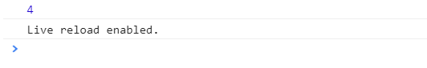
#### 2. join()

> 以指定的字符将数组连接起来，变成字符串
>
> 通常和String中的split连用，splint 是以指定字符分割成数组
>
> 参数：指定的字符, 如果未传参则是以逗号(,)分割

```js
 let arr = ['a', 'b', 'c', 'd'];
 console.log(arr.join('1'));
 console.log(arr.join());
 console.log(arr.join(''));
```
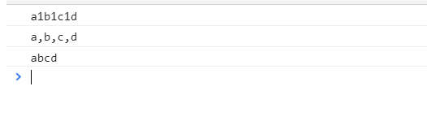
#### 3. slice()

> 按传入的下标截取数组
>
> 参数1：开始截取的位置即下标
>
> 参数2：可选 若不传则默认截取到末尾。若传入则截取到该下标的前一位，不包括当前下标的一位。
>
> 返回值：返回按指定下标截取后的数组(前包后不包)，不会影响原数组 (若想删除一个数组中的某几项则用splice())
> 
> 若传入负数则从数组的末尾往前数

```js
 let arr = ['a', 'b', 'c', 'd', 'e', 'f'];
 console.log(arr);
 console.log(arr.slice(1, 3));
 console.log(arr.slice(1));
 console.log(arr.slice(-3));
 console.log(arr.slice(-3, -1));
```
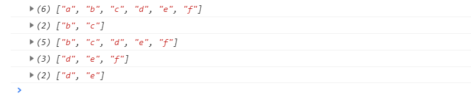
#### 4. splice() 删除或添加数组

> 参数1：开始删除的位置即下标
>
> 参数2：可选 删除元素个数长度。若不传则默认删除到最后
>
> 参数3,4,5...: 添加的项数
>
> 返回值：返回删除后的数组，会改变原数组

```js
 let arr = ['a', 'b', 'c', 'd', 'e', 'f'];
 console.log(arr);
 console.log(arr.splice(2, 3));
 console.log(arr);
 let arr1 = ['a', 'b', 'c', 'd', 'e', 'f'];
 console.log(arr1);
 console.log(arr1.splice(2, 2, 'xx', 'aa'));
 console.log(arr1);
```
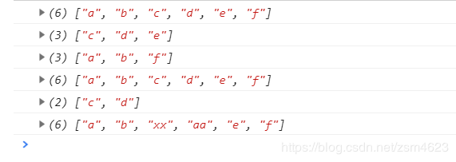
#### 5. pop()和push()

> pop() 移除数组的最后一项
>
> 返回值：返回删除的项，会改变数组长度
>
> push() 向一个数组后面添加项数
>
> 返回值：返回添加后的数组长度， 会改变原来数组

```js
let arr = ['a', 'b', 'c'];
console.log(arr);
console.log(arr.pop());
console.log(arr);
let arr1 = ['a', 'b', 'c'];
console.log(arr1);
console.log(arr1.push('z'));
console.log(arr1);
```
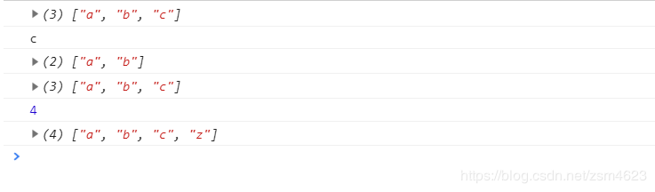
#### 6. shift()和unshift()

> shift()  删除数组中的第一项
>
> 返回值：返回删除的项 会改变原数组
>
> unshift()  向数组的最前面添加项
>
> 返回值：返回新的数组长度， 会改变原数组

```js
 let arr = ['a', 'b'];
 console.log(arr);
 console.log(arr.shift());
 console.log(arr);
 let arr1 = ['a', 'b'];
 console.log(arr1);
 console.log(arr1.unshift('x', 'z'));
 console.log(arr1);
```
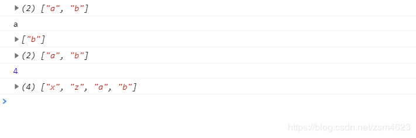
#### 7.  sort()

> 排序从小到大
>
> 返回值: 返回新数组 会改变原数组

```js
 let arr = [1, 3, 5, 3, 2, 4];
 console.log(arr);
 console.log(arr.sort());
 console.log(arr);
```
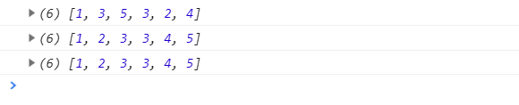
#### 8. reverse()
> 数组反转
> 
> 返回值：返回新数组，会改变原数组

```js
 let arr = [1, 3, 5, 3, 2, 4];
 console.log(arr);
 console.log(arr.reverse());
 console.log(arr);
```
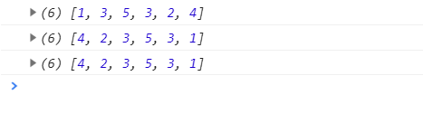
#### 9. concat()
> 两个数组连接
>
> 返回值：返回新数组，不会改变原数组

```js
 let arr = ['a', 'b'];
 let arr1 = ['x', 'z'];
 console.log(arr.concat(arr1));
 console.log(arr);
 console.log(arr1);
```
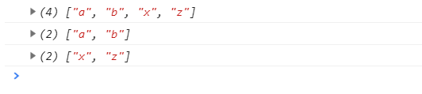
#### 10. indexOf()和lastIndexOf()

> 查找一个数组(从首位开始查询)中是否存在某个值，若存在返回当前的下标(只能匹配第一次出现)，否则返回-1
>
> 参数1：要查找的某个值
>
> 参数2：可选 传入指定的下标，指定从哪个位置开始查询
>
> lastIndexOf() 查找一个数组(从末尾开始倒着查询)中是否存在某个值(最后出现的值)，若存在返回当前的下标(只能匹配第一次出现)，否则返回-1
>
> 参数1：要查找的某个值
>
> 参数2：可选 传入指定的下标，指定从哪个位置之前查询

```js
 let arr = ['a', 'b', 'c', 'd', 'b', 'e'];
 console.log(arr);
 console.log(arr.indexOf('b'));
 console.log(arr.indexOf('f'));
 console.log(arr.indexOf('d', 2));
 let arr1 = ['a', 'b', 'c', 'd', 'b', 'e'];
 console.log(arr1);
 console.log(arr1.lastIndexOf('b'));
 console.log(arr1.lastIndexOf('f'));
 console.log(arr1.lastIndexOf('d', 3)); // 这里就是从数组['a', 'b', 'c', 'd'] 查询是否有'd'
```
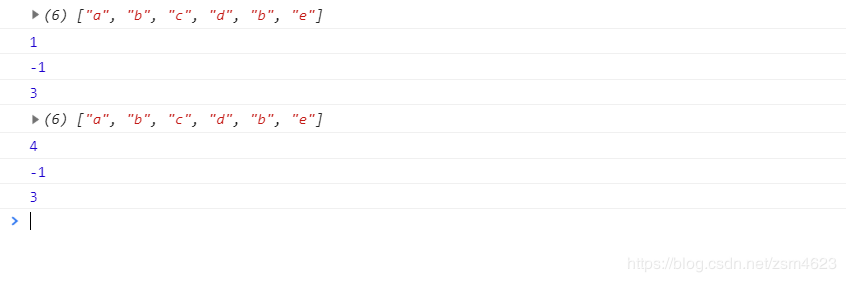
#### 11. every()

>  检测数组的每一项是否都符合条件，符合返回true，若有一项不符合则停止检测返回false
>
> 参数：函数，有三个参数分别为，当前的项，当前项的下标，检测的数组
>
> 注意：不用改变原数组

```js
 let arr = [1, 2, 3, 4, 5];
 let arr1 = arr.every((item, x, y) => {
    console.log(item, x, y)
    return item >= 1
 })
 console.log(arr1);
```
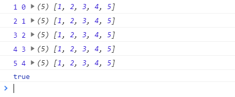
#### 12. some()

> 检测数组中是否存在符合指定的条件，若有符合条件的则停止检测返回true，否则false
> 
> 参数：函数， 有三个参数分别为，当前的项，当前项的下标，检测的数组
>
> 注意：不用改变原数组

```js
let arr = [1, 2, 3, 4, 5];
let arr2 = arr.some((x, y, z) => {
    console.log(x, y, z);
    return x > 2
 })
 console.log(arr2);
```
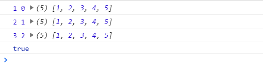
#### 13. filter()

> 过滤
>
> 检测数组，返回符合条件的内容， 没有符合的则返回空数组
>
> 参数：函数， 有三个参数分别为，当前的项，当前项的下标，检测的数组
>
> 注意：不用改变原数组
```js
let arr = [1, 2, 3, 4, 5];
let arr1 = arr.filter((x, y, z) => {
   console.log(x, y, z);
   return x > 2
})
console.log(arr1);
```
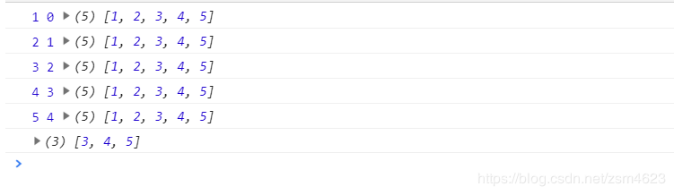
#### 14. map()

> 映射
>
> Array.map((item, index) => {})
>
> 返回一个新的数组, 新数组中的元素是原数组调用函数后处理过的值

```js
 let arr = [1, 2, 3, 4, 5];
 let arr1 = arr.map((item, index) => {
    return item * index
 })
 console.log(arr1);
```
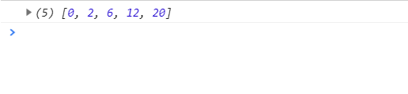
ES6 新增

#### 15. includes()

> 检测数组是否存在某个值，存在为true，否则为false
>
> 参数1：传入的指定值
>
> 参数2：可选，表示搜索的起始位置，默认为0。若为负数，则从数组倒着查询
>
> 注意：
>
>    1. 如果传入的值为整数，其长度大于数组长度则返回false
> 
>    2. 如果传入的值为负数，其长度大于数组长度则重置从0开始查询

```js
 let arr = ['x', 'b', 'a', 'c', 'd', 'e'];
 console.log(arr.includes('b'));
 console.log(arr.includes('z'));
 console.log(arr.includes('a', 1));
 console.log(arr.includes('a', 3));
 console.log(arr.includes('e', -2)); // 这里其实是从['d', 'e']中查询值'e'是否存在
 console.log(arr.includes('e', 10)); 
```
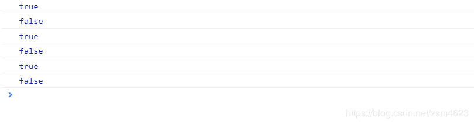
#### 16. Array.of() 
> 将一组值转为数组
>
> 如果没有传入参数则返回一个空数组[]
>
> 其实Array.of()可以代替Array()和new Array() 去创建和声明一个新数组

```js
 console.log(Array.of());
 console.log(Array.of('a'));
 console.log(Array.of(1, 'a', 3, 'ab'));
 console.log(Array.of(1, [1, 'a'], 3, 'ab'));
 console.log(Array.of(1, 2, 3, 4, 5));
```
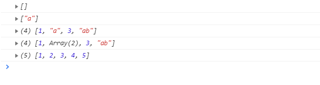
#### 17. fill()

> 使用定值去填充一个数组，数组中的元素会被全部抹除
> 
> fill() 还会接受参数二和参数三，可以指定填充的起始位置和结束位置(前包后不包)

```js
 let arr = ['a', 'b', 'c'];
 console.log(arr.fill(1));
 let arr1 = ['a', 'b', 'c', 'd', 'e'];
 console.log(arr1.fill(2, 2, 4));
```
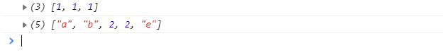
#### 18. copyWithin()
> 将数组中指定的成员项，复制到其他位置(会覆盖原来的成员)，返回新数组会改变原数组。
>
> 参数1：指定从那个位置开始替换数据
>
> 参数2：可选，默认从0开始复制。若传入则从指定位置为复制的数据，若为负数则从尾部数
>
> 参数3：可选，默认复制到最后。若传入则从指定位置结果复制的数据，若为负数则从尾部数
>
> 注意：改变原数组的方法有splice()和copyWithin()

```js
 let arr = [1, 2, 3, 4, 5, 6];
 let arr1 = [1, 2, 3, 4, 5, 6, 7, 8, 9, 10];
 let arr2 = [1, 2, 3, 4, 5, 6, 7, 8];
 let arr3 = [1, 2, 3, 4, 5, 6, 7, 8, 9, 10];
 let arr4 = [1, 2, 3, 4, 5, 6, 7, 8, 9, 10];
 let arr5 = [1, 2, 3, 4, 5, 6, 7, 8, 9, 10, 11];
 console.log(arr.copyWithin(4));
 console.log(arr);
 console.log(arr1.copyWithin(2));
 console.log(arr1);
 console.log(arr2.copyWithin(3, 4));
 console.log(arr3.copyWithin(3, 4, 6));
 console.log(arr5.copyWithin(3, -7, -5));
```
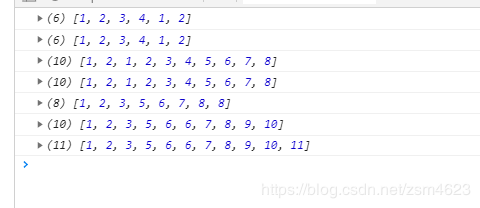
#### 19. find()和findIndex()

> find() 用来找出第一个符合条件的成员
>
> 参数是一个回调函数，依次查询每一项，直到查询到第一个符合条件的成员，并返回该项的值，若不存在则返回undefined
>
> findIndex()
>
> 返回的是符合条件的位置，而find()是返回符合条件的项，如果所有成员都不满足则返回-1
>
> 注意：
>  1. every() 查询每一项，如果每一项都符合条件就返回true，如果有一项不符合就停止，返回false
>
>  2. some() 查询每一项，只要有一项符合条件就返回true，停止查询，否则返回false

```js
 let arr = [1, 2, 3, 4, 5, 6];
 let arr1 = arr.find((item, index, arr) => {
    console.log(item, index, arr)
    return item > 3
 })
 console.log(arr1);
    
 let arr2 = [1, 2, 3, 1, 3, 5, 4, 5, 6];
 let arr3 = arr2.findIndex((item, index, arr) => {
     return item > 3
 })
 console.log(arr3);
```
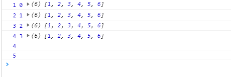
#### 20. entries(), keys()和values
> keys() 键名遍历
>
> values() 键值遍历
>
> entries() 键值对的遍历
```js
 let arr = ['a', 'b', 'c', 'd', 'e'];
 for(let i of arr.values()){
    console.log(i)
 }
 for(let i of arr.keys()){
    console.log(i)
 }
 for(let i of arr.entries()){
    console.log(i)
 }
 for(let i of arr){
    console.log(i)
 }
```
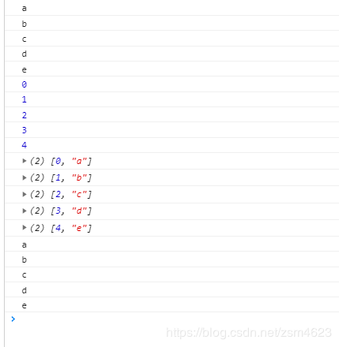

#### 21. reduce
arr.reduce(callback, initialValue)

reduce会为数组中的每个元素执行回调函数，回调函数(callback)有四个参数，分别为

prev: 上一次执行完返回的值(包括初始值)

item: 当前的元素(当前执行回调函数的元素)

index: 当前元素位置(下标index值)

arr: 原数组(执行的当前数组)

initialValue： 可选，第一次执行回调函数的初始值(也就是第一次执行回调函数时, prev的初始值，可以给他赋值为一个[], {}或者一个数字)

```js
/**数字求和*/
let arr = [1, 2, 3, 4, 5];
let sum = arr.reduce((prev, item) => {
    console.log(prev, item);
    return prev + item;
});
console.log(sum);
/** 添加一个初始值*/
let arr = [1, 2, 3, 4, 5];
let sum = arr.reduce((prev, item) => {
    console.log(prev, item);
    return prev + item;
}, 10); // 这里设置了初始值
console.log(sum);
// 如果没有添加初始值，第一次回调从数组的index为1的地方开始执行，而添加初始值后第一次回调从数组的index为0的地方开始执行
/**不设置初始值会报错*/
let arr = [1, 2, 3, 4, 5];
let Arr = arr.reduce((prev, item) => {
    console.log(prev, item);
    prev.push(item);
    return prev;
}, []); // 设置初始值后
console.log(Arr);
// 使用的时候最好给一个初始值，否则会报错
// reduce() 作用
/**1. 数字求和，上面已经介绍*/

/**2. 数字阶乘*/
let arr = [1, 2, 3, 4, 5];
let sum = arr.reduce((prev, item) => {
    console.log(prev, item);
    return prev * item;
}, 1);
console.log(sum);
/**3. 数组去重*/
let Arr = [1, 3, 2, 2, 4, 5]
let arr = Arr.reduce((prev, item) => {
    if (!prev.includes(item)){
     prev.push(item);
    }
    return prev;
}, []);
console.log(arr);
/*4. 计算数组中每个元素出现的个数*/
let Arr = [1, 3, 2, 2, 4, 5];
let arr = Arr.reduce((prev, item) => {
    if (item in prev) {
        prev[item]++;
    } else {
        prev[item] = 1;
    }
    return prev;
}, {});
console.log(arr);
/*5. 除去数组中的嵌套数组*/
let Arr = [[2, 5, 9], [0, 3]];
let arr = Arr.reduce((prev, item) => {
    // 使用concat() 或者[...]将两个数组合并
    // let as = prev.concat(item);
    let as = [...prev, ...item];
    return as;
}, []);
console.log(arr);
```
