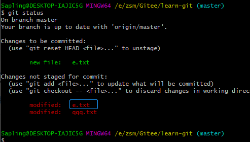

# Git常见指令

已修改（modified）、已暂存（staged）、已提交（committed）

工作目录下的文件有两种状态：已跟踪和未跟踪。未跟踪是指还未被纳入版本控制管理，已跟踪的文件指已经被纳入版本控制管理的文件。

### 1. 全局设置昵称邮箱

```js
git config --global user.name "海阔天空"
git config --global user.email "shumiao_zhg@163.com"
```

### 2. git初始化

```js
git init
```

### 2. 查看状态

```js
git status
```

### 3. git add 工作区变为暂存区

- git add + 某个文件名或某些

只提交某个文件或几个文件



- git add .

工作时的**所有变化提交**到暂存区，包括文件内容修改(modified)以及新文件(new)，但不包括被删除的文件,但会根据.gitignore做过滤

- git add .*

跟git add . 不同的是，不会根据.gitignore过滤

-  git add -u

提交被修改(modified)和被删除(deleted)文件，不包括新文件(new)

- git add -a

`git add -u` 和`git add . `的总和

### 4. git commit

- 提交暂存区的文件

```js
git commit -m ""
```

- 提交已跟踪过的文件

```js
git commit -am ""
```

tips:

-am 会把已跟踪的文件进行提交，-m是指把已跟踪的文件并处于暂存区的进行提交。间接的说，-am指令包括了`git add .`和`gitcommit -m ""`两个指令。

例子：

假如此时新建了一个a.txt文件，并输入内容`a`, 此时进行`git add .`，之后又新增内容`1`，此时内容变为`a1`，若此时直接`git commit -m ""` ，此时会把a.txt文件提交，但其中内容为`a`，因为此时的内容`1`，由于没有进行git add .是没有加入到暂存区的，是不会进行提交操作的。反之如果使用`git commit -am`，则会把内容`1`也进行提交 ，因为a.txt文件是已跟踪文件，会把所有修改一并提交。

### 5. git push

### 6. 快速切换上一个分支

```js
git checkout -
```

### 7. 展示本地分支关联远程仓库的情况

```js
git branch -vv
```


