对于JS中的字符串(String)我们经常使用，今天总结了一下常见的String方法。

#### 1. length

> 检测字符串的长度

```js
 let str = 'abcdef';
 console.log(str.length);
```
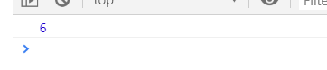
#### 2. slice()

> 截取指定位置的字符串
>
> 参数1：开始截取的位置，下标
>
> 参数2: 选填，若不填，则截取到最后。若传入要截止的下标，则截取从开始的下标到截止的下标中间的部分
>
> 若参数为负值，则从该字符串的末尾部分数
>
> 返回值: 为截取中的内容(前包后不包)， 不会改变原字符串

```js
 let str = 'abcdef';
 let str1 = str.slice(1, 3); 
 console.log(str);
 console.log(str1);
 let str2 = str.slice(1);
 console.log(str2);
 let str3 = str.slice(-3, -1);
 console.log(str3);
```
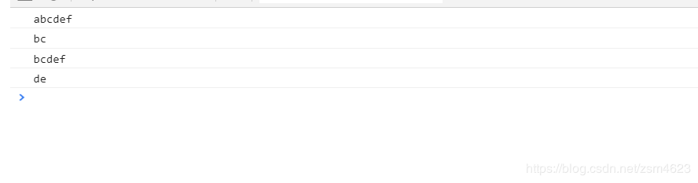
#### 3. substr
> 参数1: 开始截取字符串的下标
>
> 参数2: length长度，要截取字符的长度
>
> 若参数为负值，则从该字符串的末尾部分数
>
> 返回值: 为截取中的内容， 不会改变原字符串

```js
 let str = 'abcdef';
 let str1 = str.substr(1, 3);
 console.log(str);
 console.log(str1);
 let str2 = str.substr(1);
 console.log(str2);
 let str3 = str.substr(-3, 2);
 console.log(str3);
```
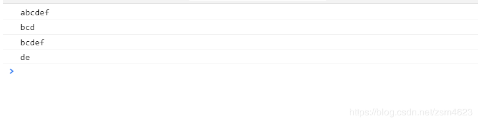
#### 4. substring

> 参数1：要截取字符的开始下标
>
> 参数2：可选，要截止的下标，若不传则会截取到末尾
>
> 返回值: 为截取中的内容(前包后不包)跟slice一样， 不会改变原字符串
>
> 注意：不能传入负值，从字符串末尾截取

```js
 let str = 'abcdef';
 let str1 = str.substring(2, 4);
 console.log(str);
 console.log(str1);
 let str2 = str.substring(2);
 console.log(str2)
```
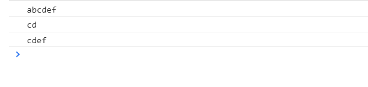
#### 5. split

> 将字符串按指定字符，把一个字符串分割成数组
>
> 参数1: 字符串中的字符，以这个字符为界限分割成数组
>
> 参数2：可选，若不传，则会将这个字符串按情况分割成数组，数组长度没限制。传入则限制数组的长度，
若分割成的数组大于指定的长度，则多余的项会省略返回值：分割后的数组，不包括指定字符本身
>
> 注意：
>  1. 如果指定的字符串为空，则会截取字符串每个都分割开
>
>  2. 可以使用正则代替指定的那个字符串

```js
 let str = 'abcdbef';
 let str1 = str.split('b');
 console.log(str1);
 let str2 = str.split('b', 2);
 console.log(str2);
 let str3 = str.split('');
 console.log(str3);
```
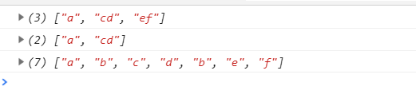
#### 6. indexOf()
> 检测指定字符首次出现的位置下标
>
> 参数1: 指定的字符
>
> 参数2：可选，从那个位置开始下标
>
> 返回值：若存在返回当前字符的下标，否则返回-1
>
> 注意对大小写敏感
```js
 let str = 'abCcdecf';
 let str1 = str.indexOf('c');
 console.log(str1);
 let str2 = str.indexOf('g');
 console.log(str2);
 let str3 = str.indexOf('c', 3);
 console.log(str3);
 let str4 = str.indexOf('c');
 console.log(str4);
```
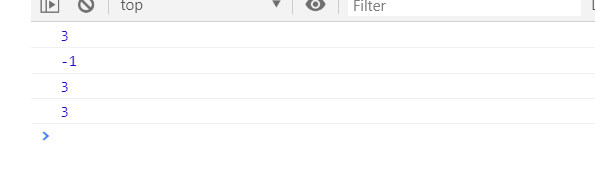
#### 7. lastIndexOf()
> 检测一个字符串中是否存在传入的字符，从该字符串的末尾查询
> 参数1：传入的指定字符
> 参数2：可选 传入指定的位置(下标)，从该位置之前的字符查询

```js
let str = 'abdcdef';
console.log(str.lastIndexOf('d'));
console.log(str.lastIndexOf('d', 1));
console.log(str.lastIndexOf('d', 3)); // 这里也就是从字符串(abdc)中查询字符(d)是否存在 
```
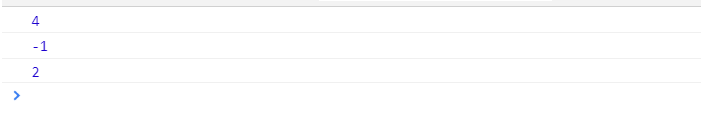
#### 8. replace()
> 将指定的字符替换成别的字符,只替换第一次出现的
>
> 参数1：要替换的指定字符
>
> 参数2：要替换成的字符
>
> 返回值：替换后的字符串
>
> 可以使用正则, 如果想替换成全部可以使用正则以及其中的g,若想忽略大小写则用i

```js
 let str = 'abcdbef';
 let str1 = str.replace('b', 'z');
 console.log(str1);
 let str2 = 'a1b2c3d4';
 let str3 = str2.replace(/\d/g, 'z');
 console.log(str3)
```
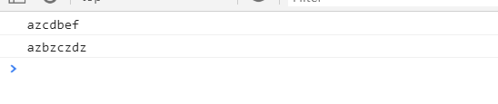
#### 9. charAt()

> 根据下标，找到该下标对应的字符
>
> 参数：字符串中某个位置的数字，就是某字符在字符串的下标
>
> 返回值：根据下标返回下标对应的字符
>
> 如果指定的下标的数字大于该字符串的长度会返回空

```js
 let str = 'abcdef';
 let str1 = str.charAt(2);
 console.log(str1);
 console.log(str)
 let str2 = str.charAt(7);
 console.log(str2);
```
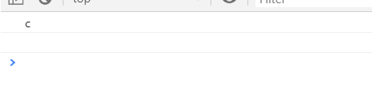
#### 10. toLowerCase()

> toLowerCase 将字符串转为小写
>
> 返回值：该字符串的小写

```js
 let str = 'ABcdef';
 let str1 = str.toLowerCase();
 console.log(str);
 console.log(str1);
```
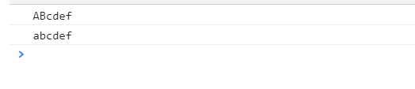
#### 11. toUpperCase()

将小写字符串转化为大写

```js
 let str = 'abcdef';
 let str1 = str.toUpperCase();
 console.log(str);
 console.log(str1);
```
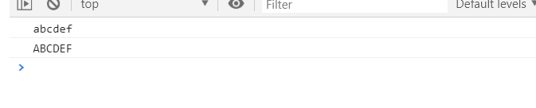
ES6 新增

#### 12. for of 字符串遍历 
```js
 for(let str of 'abcdef'){
    console.log(str);
 }
```
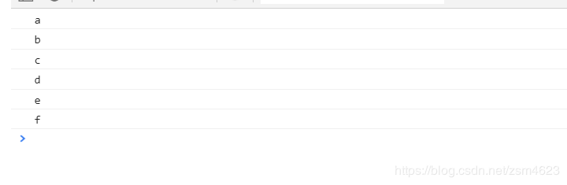

#### 13. includes(), startsWith(), endsWith()

> includes() 返回值布尔型 是否在该字符串中找到指定字符
>
> startsWith() 返回值布尔型 在该字符串头部是否存在该字符
>
> endsWith() 返回值布尔型 在该字符串尾部是否存在该字符
>
> 参数2：可选 表示开始搜索的位置
>
> 假若参数为n,endsWith()跟includes()和startsWith()有所不同，endsWith针对的是n前面的字符不包括n本身的字符
>
> 而那两个则代码从n到结尾的字符串，包括n本身

```js
  let str = 'abcdef';
  console.log(str.includes('d'));
  console.log(str.includes('z'));
  console.log(str.startsWith('a'));
  console.log(str.startsWith('b'));
  console.log(str.endsWith('f'));
  console.log(str.endsWith('z'));
  console.log(str.includes('d', 2));
  console.log(str.startsWith('d', 3));
  console.log(str.endsWith('d', 3));
  console.log(str.endsWith('c', 3));
```
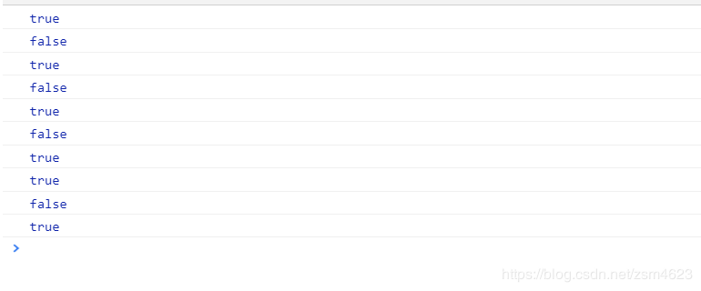
#### 14. repeat()

> 将原字符串重复n次
>
> 如果是小数会被取整

```js
 let str = 'abc';
 console.log(str);
 console.log(str.repeat(2));
 console.log(str.repeat(3.6));
```
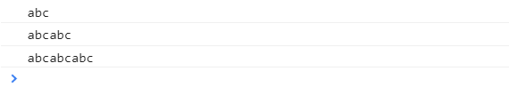
#### 15. padStart(), padEnd()

> padStart()  头部补全
>
> padEnd()    尾部补全
>
> 字符串补全，如果长度不够指定长度，补全
>
> 参数1：指定字符串长度
>
> 参数2：补全长度的字符
>
> 返回值，返回新的字符串
>
> 注意：
>
>  1. 如果指定的长度小于或等于原字符串长度，则返回原字符串
>
>  2. 如果指定的长度小于原字符串长度+要补充的字符的长度，会吧要补充的字符从尾部省略

```js
 let str = 'ab';
 console.log(str);
 console.log(str.padStart(4, 'x'));
 console.log(str.padEnd(4, 'x'));
 let str1 = 'abcdef';
 console.log(str1.padEnd(5, 'x'));
 console.log(str1.padEnd(6, 'x'));
 console.log(str.padEnd(4, '1234'));
 console.log('12'.padStart(10, 'YYYY-MM-DD'));
```

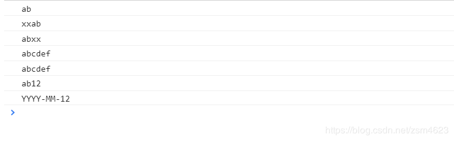

#### 16. Object.is()比较两个值是否相等

Object.is(value1, value2) 两个参数，分别是比较的二个值，返回值布尔类型。

跟`==`区别，`==`在比较时会强制类型转化， 1 == '1' 会返回true, 而Object.is() 会跟`===`一样不会强制转化
但也有区别当两个值都为NaN时，`===`会返回false，而Object.is()则返回true。当-0和+0比较时，`===`会返回true，而Object.is()会返回false

```js
1 == '1' // true
Object.is(1, '1'); // false
NaN === NaN // false
Object.is(NaN, NaN); // true
-0 === +0 // true
Object.is(-0, +0); // false
```


