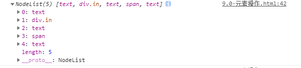
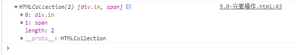

# JavaScript

### 1. 获取元素

1. 根据id名称获取元素

```js
var node = document.getElementById('id');
```
2. 根据标签名称获取元素


```js
var node = document.getElementsByTagName('span');
```

返回是一个数组形式，若需要获取第一个则`node[0]`。

例子

```js
var arr = [];
// 1 获取body中所有标签
var tags = document.body.getElementsByTagName('*');
// 2 依次检测类名
for (var i = 0; i < tags.length; i++) {
	// 3 检测时为了保证准确，可以将类名分隔为多个部分，再依次检测
	var classArr = tags[i].className.split(' ');
	// 4 遍历classArr，检测每个部分
	for (var j = 0; j < classArr.length; j++) {
		if (classArr[j] === 'box') {
			arr.push(tags[i]);
			break; // 减少循环次数
		}
	}
}
console.log(arr);
```
3. 根据类名获取元素
 
```js
var node = document.getElementsByClassName('className');
```
返回是一个数组形式，若需要获取第一个则`node[0]`。

4. 根据标签的name属性获取元素

标签的name属性可能多个标签含有相同的name属性值，所以返回值也是一个数组形式

```js
var node = document.getElementsByName('nodeName');
```


5. H5新增CSS选择器

```js
// 获取一个
var node = document.querySelector('');
// 返回获取到的元素可填入标签名，类名和id名，类名需带(.)和id名需带(#)标识

//获取多个 (伪数组)
var node = document.querySelectorAll('');
// 返回的是满足情况的一个数组集合形式，可传入标签名，类名和id名
```


### 2. 属性操作

1. 第一种方法

```js
var box = document.getElementById('box');
// 设置属性
box.setAttribute('data-hehe', '这是新属性');
// 获取属性
box.getAttribute('data-hehe');
// 删除属性
box.removeAttribute('data-hehe');
```

2. 第二种方法

```js
var box = document.getElementById('box');
box.id = '';
box.className = '';
```
3. 第三种方法

```js
// 获取元素
const box = document.getElementById('id');
// 设置一个属性
const box1 = document.creatAttribute("aa");
// 设置属性值
box1.value = '属性值';
// 将属性赋值到box
box.setAttributeNode('box1');
// 删除属性
box.removeAttributeNode('box1');
```

4. 第四种方法(自定义属性dataset)

使用自定义属性设置，获取时不需要填入`data-`，直接写入后面的即可

```js
const element = document.querySelect('#id');
// 设置属性
element.dataset.a = '1';
// 获取属性
const box = element.dataset.a;
```

### 3. 文本操作(innerText和innerHTML)

>相同点: 都可以对原内容造成覆盖


> 区别: innerHTML 可以操作文本和标签结构
> innerText 只能操作文本结构

```js
var box = document.getElementById('box');
box.innerText = '这是新内容';
box.innerHTML = '<p>这是新内容</p>';

```

1. 兼容性

innerText在火狐上有问题

textContent 在ie678中有问题

```js
function getText (element) {
	if (typeof element.innerText === 'string') {
		// 支持innerText
		return element.innerText;
	} else {
		// 支持textContent
		return element.textContent;
	}
}
console.log(getText(box));
```

### 4. DOM元素

1. 创建一个元素

document.createElement()

```js
var DOM = document.createElement('div'); 
```
2. 添加(移动)节点

1）appendChild() 向节点的子节点的结尾添加一个新的子节点

- 向body中添加一个div标签

```js
var box = document.createElement('div');
console.log(box);
document.body.appendChild(box);
```
- 将p标签移动到div标签中

```html
<p>子节点</p>
<div>
  <span></span>
<div>
```
```js
var node = document.querySelector('div');
var nodeP = document.querySelector('p');
node.appendChild(nodeP);
```
移动之后变为

```html
<div>
  <span></span>
  <p></p>
</div>
```

2）nodeParent.insertBefore('要移动的节点','参考节点'); 

nodeParent为父节点  

节点会移动到参考节点的前面, 当第二个参数传入null或undefined时,和appendChild性质一样。

3. 删除节点

node.removeChild(nodeChild)，删除某个元素下的一个子节点

```html
<p>
  <span>ss</span>
</p>
```
```js
const nodeP = document.querySelect('p');
const nodeSpan = document.querySelect('span');
nodeP.removeChild(nodeSpan); // 删除p标签下的span标签
```
4. 克隆

node.cloneNode(deep)

deep为true时，会克隆其子元素，为false时，单单克隆此元素

例子：

克隆含有类名为in的div元素以及子元素，并且移动到含有类名为out的div元素的前面。
```html
<div class="out">
  <div class="in">
    <p></p>
  </div>
</div>
```
```js
var boxOut = document.querySelector('.out');
var boxIn = document.querySelector('.in');
var node = boxIn.cloneNode(true);
boxOut.insertBefore(node, boxIn);
```

2. 上下级访问
parentNode - 获取父节点

childNodes  // 获取所有的子节点，伪数组

children // 获取所有的子元素，伪数组（最常用）

firstChild // 第一个子节点

firstElementChild // 第一个子元素节点 有兼容性问题

lastChild // 最后一个子节点

lastElementChild // 最后一个子元素节点 有兼容性问题

```html
<div class="out">
  <div class="in">
    <p></p>
  </div>
  <span></span>
</div>
```

- parentNode - 获取父节点

```js
var nodeP = document.querySelector('p');
var a = nodeP.parentNode;
console.log(a);
```

- childNodes - 获取所有子节点,伪数组(包括子代以及子代的子代等等)

```js
var out = document.querySelector('.out');
var node = out.childNodes;
console.log(node);
```


- children - 获取所有元素子节点(只包括子代的元素)

```js
var out = document.querySelector('.out');
var node = out.children;
console.log(node);
```


firstChild 获取第一个字点

lastChild 获取最后一个子节点

3. 同级访问

nextSibling 后一个同级节点


备注：获取body的方法

```js
// 1.
document.body
// 2.
document.getElementsByTagName('boby')[0]
```

### 5. 样式设置方式

1. style方式设置

```js
var box = document.getElementById('box');
box.style.width = '100px';
// 注意 background-color 这种形式的样式在js中需要更改为驼峰命名法
// font-size 变成 fontSize .. 
box.style.backgroundColor = 'red';  
```

2. 类名操作

```js
var box = document.getElementById('box');
box.className= 'colorBlue';
```

3. 获取样式

style 获取样式只能适用于行内

存在兼容性

```js
// 获取宽
getComputedStyle(box).width

//getComputedStyle在ie的低版本678不支持，ie中使用currentStyle属性进行功能的替代
```

解决方案
```js
function getStyle (element, styleName) {
// 函数的形参就是一个局部变量，值从实参位置得到
// styleName = 'width'
if (element.currentStyle) {
	return element.currentStyle[styleName];
  } else {
	return getComputedStyle(element)[styleName];
  }
}
getStyle(box, 'width');
```
### 6. 表单

1. 获取内容

input, textarea 使用value 可以获取

button, option 使用innerText获取

2. 复选框中的属性
checked代表选中

3. 下拉菜单中的属性
selected 为true时,为选中,false时为没选中

4. 禁用
disabled 为true时,为选中,false时为没选中

### 7. BOM

1. open和close方法

open()开启一个新窗口

open('URL', '打开方式', '宽高');

close() 关闭

2. location 是window对象的属性

> 1 href 跳转
> location.href = 'URL';
>
> 2 assign() 跳转
> location.assign('URL');
>
> 3 replace() 跳转 会替换当前路径,返回不回去了
> location.replace('URL');
>
> 4 reload() 刷新
> location.reload(true) 强制刷新
> location.reload(false) 刷新

```js
hash 哈希值 就是瞄点
host 服务器地址: 服务器+端口号
hostname 服务器名
port 端口
pathname 路径名
protocol 协议
search 参数
```

3. navigator

window.navigator的一些属性可以获取客户端的一些信息

4. 

定时器

setTimeout(fn,time)

clearTimeout()

setInterval(fn,time)

clearInterval()


```js
// 匀速运动
btn.onclick = function () {
	clearInterval(timer);
	timer = setInterval(function () {
		// 1 获取元素当前位置
		var current = box.offsetLeft;
		// 2 设置步长
		var step = 10;
	
		// 5 设置运动的结束条件
		if (current < 400) {
			// 3 套用运动公式：  元素的位置(新) = 元素的位置(旧) + 步长
			current += step;
			// 4 将新的位置值设置给left属性
			box.style.left = current + 'px';
		} else {
			clearInterval(timer);
		}
	}, 20);
};
```

```js
//变速运动
function animate(element, target) {
    clearInterval(element.timer);
    element.timer = setInterval(function() {
        // 1 获取元素当前位置
        var current = element.offsetLeft;
        // 2 设置步长
        // 变速运动的步长公式：  (target - current) / 10
        var step = (target - current) / 10;
        // --- 后期添加：对step的值进行取整
        //    如果为正数进行向上取整，如果是负数向下取整
        step = step > 0 ? Math.ceil(step) : Math.floor(step);
        // 3 设置运动公式
        current = current + step;
        // 4 将current设置给left属性
        element.style.left = current + 'px';
        // 5 运动完毕后，清除定时器
        if (current === target) {
            clearInterval(element.timer);
        }
    }, 20);
}
```
### 8. 事件操作

**事件三要素**
> 事件源: 触发事件的元素
> 
> 事件类型: 例如点击事件(click)
> 
> 事件处理程序: 也就是事件触发后执行的代码

- 事件冒泡

事件默认传递方式为由内向外,这种默认传递方式称为事件冒泡

1 事件冒泡是事件的默认传递方式

2 执行顺序: 从内向外。当前元素触发事件后,自身的事件会触发,还会将事件传递给父元素,如果父元素也有相同的类型也会执行,依次类推。

- 事件捕获

事件捕获不是事件的默认传递方式，所以需要使用某种方式进行设置。

1 设置方式：addEventListener()的参数3，默认值为false表示事件冒泡，true表示事件捕获

2 执行顺序：与事件冒泡相反，从外向内。

- 事件执行的三个阶段

1 事件捕获

2 目标事件

3 事件冒泡

- 事件对象
当事件触发后会有一些其他的信息,我们无法获取得到

获取方式 在事件函数中的形参位置接收一个参数,在ie9以下用window.event。


- 事件委托

应用了事件冒泡的原理

- 事件类型

```js
click 点击事件
mouseover 移入事件(事件冒泡)
mouseout  移出事件(事件冒泡)
mouseenter 移入
mouseleave 移出
focus 获取焦点
blus  失去焦点
keydown 键盘按下
keyup 键盘抬起
progress 文件下载时
```

普通的事件

会覆盖, 移除时直接赋值为null即可

新方式

node.addEventListener('事件类型',fn);

移除

node.removeEventListener('事件类型',fn);

兼容性

在ie9以下用node.attachEvent('事件类型',fn);

移除 node.detachEvent('事件类型', fn);


### 9. return

使用return时，return什么，也就返回了什么，比如函数返回一个值。

遇到的一个例子
```js
const yanZheng = () => {
  const count = 2;
  if (count != 1) {
    return '返回的值走的if判断里的';
  }
  return '返回的值走的最后的'
}
```
这时，变量`count`为2，走的if判断时为true进入了if语句中，这时在语句中return出了值，意思说这个程序(函数)就结束了，不会往下继续执行了。

而如果此时把变量`count`改为1时，就不会进入if语句中了，返回的是最后的return，此时函数返回的值就为`返回的值走的最后的`。

### 10. 鼠标坐标等其他

1. 鼠标坐标
指可视区域

clientX - 鼠标针对页面可视区域的横坐标

clientY - 鼠标针对页面可视区域的纵坐标

2. offset系列属性
offsetLeft/offsetTop 指当前元素到定位父盒子之间的左侧/顶部距离(两个边框之间的距离)
返回类型为数值,只读。

offsetHeight/offsetWidth 指当前元素的高度(除margin之外)

offsetParent - 用于获取当前元素外的定位父盒子

3. 拖拽

当点击一个盒子时,获取鼠标在盒子中的距离

```js
box.onclick = function(e){
	var x = e.clientX - box.offsetLeft;
	var y = e.clientY - box.offsetTop;
	console.log(x, y);
}
```

取消标签默认效果和阻止事件传播方式

都可以用return false

单独针对取消标签默认效果可以用: e.preventDefault()

单独针对阻止事件传播: e.stopPropagation()

### 11. formdata对象

1. 对表单进行formData初始化

```js
var form = document.querySelector('.form');
// 将要提交的表单作为参数，进行初始化
var formData = new formData(form);
```

2. 对formData进行操作

```js
// 1. 添加一项 append(key, value)
formData.append('a', 1); // 添加了一项key为a, 值为1的数据

// 2. 获取某一项的值 get(key)
formData.get('a'); // 获取为a的值，若不存在在为null

// 3. 修改某一项 set(key, value)

formData.set('b', 1); // 修改key为b的值为1， 如果之前b不存在则添加一项

// 4. 查询是否有对应的key has(key)
formData.has('a'); // 查询是否存在key为a的数据

// 5. 删除某一项 delete(key)
formData.delete('b'); // 将key为b的数据删除

```

小案例:  点击button按钮时，将用户名和密码值通过ajax发送到后端php页面


FormData对象优势就是能够一次性将表单中的所有数据全部取出，包括文件域的文件对象。

1)创建表单 --- form标签很重要， method和action不重要
   每个表单域需要设置name值

2)发送ajax请求
①将表单数据取出 --- FormData
i.获取form表单对象:        var fm = document.getElementById(‘mainForm’);  //DOM对象
ii.实例化FormData对象:  var fd = new FormData(fm);

②发送ajax请求
   使用FormData对象以后，必须使用post方式来发送ajax请求。
   将FormData对象，作为参数传入 send方法中  xhr.send(fd);

③ 使用FormData对象提交表单时，不需要设置 setRequestHeader方法

```js
//1. 注册按钮绑定点击事件
document.getElementById('btn').onclick = function () {
    //2. 事件函数
    // 1) 获取表单数据 （用户名和密码） --- FormData
    //  ① 获取表单对象 --- DOM对象
    var fm = document.getElementById('main');
    //  ② 实例化FormData对象，并将表单对象作为参数传入
    var fd = new FormData(fm);

    // 2) 发送ajax请求，并将表单数据一起发送给后端php页面
    var xhr = getXhr();

    xhr.onreadystatechange = function () {
        if (xhr.readyState == 4 && xhr.status == 200) {
            alert(xhr.responseText);
        }
    }

    //使用FormData必须使用post请求
    xhr.open('post', 'formdata.php');
    //发送ajax请求时，将fd作为参数传入
    xhr.send(fd);
}
```

### 12. js中的回调函数

回调函数就是把函数当做参数传入，并执行。

JavaScript是事件驱动的语言，意味着JavaScript不会因为等待一个响应而停止当前运行，而回调确保了一段代码执行完后再执行另一段代码

- 例子：

下面这段代码正常情况下，先输出1，然后输出2
```js
function first(){
  console.log(1);
}

function second(){
  console.log(2);
}

first();
second();
```
假如此时first()函数变为响应的，需要请求，此时虽然先调用first函数，但因为是响应式的，不会停止运行而是会先执行second函数，等到响应有结果了再执行second函数。

```js
function first(){
  // 这里使用一个定时器用来代替请求的接口
  setTime(function() {
    console.log(1);
  }, 1000)
}

function second(){
  console.log(2);
}

first();
second();
```

结果将先输出2然后再输出1，但这并不是我们想要的，此时就可以用到回调函数，将second作为参数传入到first函数中，适当的时候在调用second函数即可，就能实现先输出1再输出2。

使用回调函数
```js
function first(callback){
  // 这里使用一个定时器用来代替请求的接口
  setTimeout(function() {
    console.log(1);
    callback(1);
  }, 1000)
}

function second(num){
  console.log(2+num);
}
first(second); 
```
此时则先输出1再输出2

- 回调函数的特点

1. 不会立即执行

回调函数作为参数传递给一个函数时，传递的只是定义并不会立即执行，也跟普通函数一样需要调用才会执行。

2. this的使用

在回调函数调用时this执行的上下文并不是回调函数定义时的那个上下文，而是调用它的函数所在的上下文。

```js
let obj = {
    sum: 0,
    add: function(num1, num2){
        this.sum = num1 + num2;
    }
};

function add(num1, num2, callback){
    callback(num1, num2);
};

add(1,2, obj.add);
console.log(obj.sum);            //=>0
console.log(window.sum);        //=>3
```
调用这个函数的的上下文this指的是window，所以这里的this其实指向window的，而并不是变量obj的

使用`apply`进行改变this的指向

```js
let obj = {
    sum: 0,
    add: function(num1, num2){
        this.sum = num1 + num2;
    }
};

function add(num1, num2, obj, callback){
    callback(obj, [num1, num2]);
};

add(1,2, obj, obj.add);
console.log(obj.sum);            //=>0
console.log(window.sum);        //=> undefined
```
此时通过`apply`更改了`this`的指向，从而回调函数当前指向定义时上下文的this。

2. 是一个闭包

回调函数是一个闭包，能够访问到其他外层定义的变量

### 13. js中的闭包

- 概念

闭包说白了就是在一个函数中的函数，就是函数套一个函数这就叫做闭包。内部函数可以访问外部函数的变量

闭包能够让你从内部函数访问外部函数声明的参数和变量

- 特点


```js
function init() {
  var name = "Mozilla"; // name 是一个被 init 创建的局部变量
  function displayName() { // displayName() 是内部函数，一个闭包
      console.log(name); // 使用了父函数中声明的变量
  }
  displayName();
}
init();
```
这里`init`函数创建了一个内部变量`name`和一个名为`displayName`的函数。`displayName`函数定义在`init`函数的内部，只在
`init`中才管用，而`displayName`函数没有自己的局部变量，但他可以访问到外部函数的变量，因此可以使用`displayName`中父函数`init`中声明的变量。

然而这并不是闭包，而只是看起来是，`但却是很重要的一部分，函数能访问外部的作用域`。

```js
function foo(){
    var a = 2;
    function bar(){
        console.log(a);
    }
    return bar;
}
var baz = foo();
baz(); // 2 —— 这就是闭包

```


闭包它允许将函数与其所操作的某些数据（环境）关联起来。

- 应用

for循环时，当用var声明i时，打印出来都是


### 13. 防抖

```js
let flag = true;
  function btn (){
    if (!flag) {
      console.log('过滤掉')
      return
    }
    flag = false;
    setTimeout(function () {
      console.log('防抖22222222执行的函数')
      flag = true
    }, 2000)
  }
```
### 13. ajax

什么是ajax

首先来说ajax并不是一门新的语言，而是一种现有的标准的新方法。它最大的优点在于不用重新加载整个页面的情况下，可以与服务端交换数据并更新网页内容，能快速创建动态网页的技术。

ajax 使用的是`XMLHttpResquest`方法，具有兼容性，ie7以下需要兼容

```js
function getXhr() {
  var xmlHttp = '';
  if (window.XMLHttpResquest) {
    // Chrome, IE7+, Opera, Firefox, Safair
    xmlHttp = new XMLHttpResquest();
  } else {
    // IE5,IE6
    xmlHttp = new ActiveXObject('Msxml2.XMLHTTP');
  }
  return xmlHttp;
}
```

例子：

```js
function () {
  // 创建XMLHttpResquest对象
  let xhr = getXhr();
  xhr.onreadystatechange = function() {
    if (xhr.readState == 4 && xhr.status == 200) {
      // 发送ajax成功后的操作
    }
  }
  // 设置请求头，看后台的要求 
  // 常见的有 application/json  multipart/form-data  x-www-form-urlencoded
  xhr.setRequsetHeader('content-type', 'application/x-www-form-urlencoded');
  // 设置请求类型post，get以及请求路径
  // xhr.open(post, url)
  xhr.open('post', 'index.php');
  // 发送ajax请求并传入参数，get类型时不用传，若需传则拼接到url后面
  xhr.send(data); 
}
```

- 服务器响应 

属性：responseText， 获得字符串形式的响应数据

- onreadystatechange 事件

当请求发送到服务器时，会执行一些基于响应的任务，每当`readState`改变时，就会触发`onreadystatechange`事件

XMLHttpResquset对象的三个重要属性

属性|描述
--|:--
onreadystatechange| 函数，每当readState改变时都会触发这个函数
readyState|0 - 4，  0 请求未初始化（还没有调用 open()）。1 请求已经建立，但是还没有发送（还没有调用 send()）。 2 请求已发送，正在处理中（通常现在可以从响应中获取内容头）。 3 请求在处理中；通常响应中已有部分数据可用了，但是服务器还没有完成响应的生成。 4 响应已完成；您可以获取并使用服务器的响应了。
status| 200:'ok'  ， 404: '未找到页面'      


ajax上传文件

```js

/**
 * 
 * 核心:  xhr对象中有一个子对象upload，在upload对象中有一个onprogress事件，
 * 该事件大约每100ms触发一次。该事件中有两个属性  loaded（已上传文件大小）   
 *   total（文件总大小）
 * 
 * */
//1. 获取上传按钮，绑定点击事件
//1. 获取上传按钮，绑定点击事件
document.getElementById('btn').onclick = function () {
    //2. 事件函数
    // 1) 获取文件对象 --- FormData
    // ① 获取form对象 -- DOM对象
    var fm = document.getElementById('main');-
    // ② 实例化FormData对象
    var fd = new FormData(fm);
	

    // 2) 发送ajax请求，同时将文件上传到服务器
    var xhr = getXhr();
    //console.log(xhr);
    var percent = 0;
    var inner_obj = document.getElementById('inner');
    xhr.upload.onprogress = function (evt) {
        console.log(evt);
        //计算上传百分比
        //toFixed(2): 保留小数点后2位
        percent = (evt.loaded / evt.total).toFixed(2);
        //根据百分比重新绘制 inner的width值
        inner_obj.style.width = percent * 300 + 'px';
    }

    xhr.onreadystatechange = function () {
        if (xhr.readyState == 4 && xhr.status == 200) {
            //alert(xhr.responseText);
            if (xhr.responseText == 1) {
                alert('文件上传成功');
            } else {
                alert('文件上传失败');
            }
        }
    }
    //准备请求
    xhr.open('post', 'index.php');
    //发送请求
    xhr.send(fd);
}
```