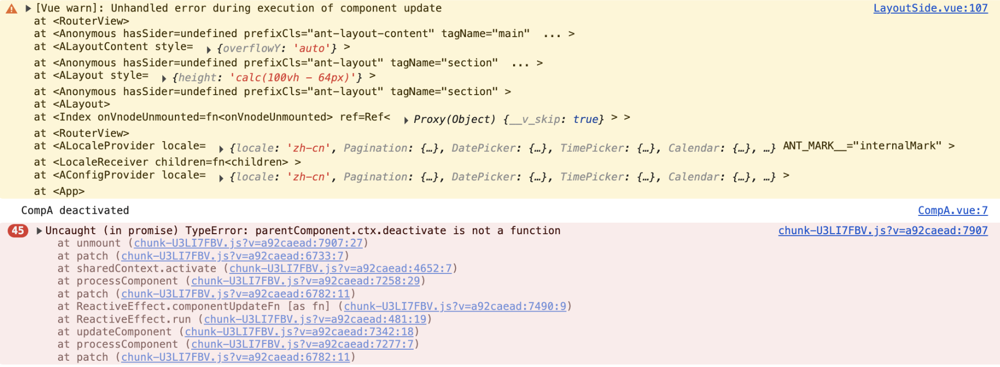

# 使用keepAlive后报错，报错信息 Uncaught (in promise) TypeError: parentComponent.ctx.deactivate is not a function


## 报错信息

Uncaught (in promise) TypeError: parentComponent.ctx.deactivate is not a function




原因：

通常是因为 **组件的渲染条件切换导致上下文丢失**。

使用了v-if，报的错

```vue
<router-view v-slot="{ Component, route}">
  <keep-alive>
    <component :is="Component" v-if="route.meta.keepAlive"/>
  </keep-alive>
  <component :is="Component" v-if="!route.meta.keepAlive" />
</router-view>
```

解决：

**确保 `key` 唯一**：使用路由路径作为 `key`，防止组件复用导致状态混乱

```vue
<router-view v-slot="{ Component, route}">
  <keep-alive>
    <component :is="Component" v-if="route.meta.keepAlive" :key="route.path"/>
  </keep-alive>
  <component :is="Component" v-if="!route.meta.keepAlive" :key="route.path"/>
</router-view>
```

https://chat.deepseek.com/a/chat/s/d9757e90-e8c1-4c0f-8294-ea883306985e


