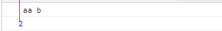
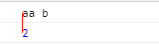

## 1. let和const介绍

1. const介绍
声明一个只读的常量，声明后不允许去更改

```js
const str = '123';
str = '456';
console.log(str);
// TypeError: Assignment to constant variable.
```

会报错，声明常量的值不允许去修改

也就意味着，如果使用`const`去声明一个变量，就要立马去声明一个初始值，不能等以后再去赋值。

另外还有一些注意项

-  `const`的作用域和`let`一样，只能在声明的块级作用域内有效

```js
if (true) {
  const message = '内部的块级作用域'
}
console.log(message);
// TypeError: Assignment to constant variable.
```

-  `const`声明的常量和`let`一样不存在变量提升，会有暂时性死区，只能在声明后的位置去使用

```js
if (true) {
  console.log(message);
  // TypeError: Assignment to constant variable.
  const message = '123';
}

```

- 在同一作用域内一个常量名只能声明一次

```js
if (true) {
  const str = '12';
  console.log(str);
  const str = '34';
  console.log(str);
}
// Uncaught SyntaxError: Identifier 'str' has already been declared
```

```js
if (true) {
  const str = '12';
  console.log(str); // 12
}
const str = '34';
console.log(str); // 34
```

2. const本质

`const`所声明的变量，并不是指的的变量的值不能变更，而是变量指向的那个内存地址所报存的数据不改动(就是内存地址的值不能变)。对于简单的数据类型来说，变量的值就保存在变量指向的那个内存地址(内存地址的值等于变量名)，等同于变量。但对于复杂的数据类型来说(数组，对象)，变量指向的内存地址，保存的只是一个指向真实数据的一个指针，`const`只能保证这个指针不能修改，但对于这个指针指向的数据控制不了。


> 总的一句话就是：对于简单数据类型来说，内存地址保存的是变量的值。而对于复杂的数据类型来说内存地址保存的是一个指针，这个指针指向了真实的数据，只能保证这个指针不允许变化。


```js
let obj = {
  name: '初始化的name属性值'
}
obj.name = '更改后的name属性值';
console.log(obj.name); // 更改后的name属性值
```

```js
let obj = {};
obj = {}
console.log(obj); // Uncaught TypeError: Assignment to constant variable.
```

对于复杂的数据类型来说，可以修改其属性或方法，但是不能重新给其赋值，那样会改变其指向的内存地址的指针，从而报错。

## 2. 字符串的扩展

1. 模板字符串

在es6之前拼接字符串都要使用`+`号，比较麻烦

es6中的模板字符串

使用反引号``和${}, 在${}中写入变量即可。

```js
const h = '模板字符串';
const demo = `这是es6中的${h}`;
```
扩展：

1）如果想再模板字符串中使用反引号，需要使用反斜杠进行转义。

2）在模板字符串中的空格或者换行都会保留的，如果想消除两侧的空格，则可以使用`trim`进行消除。

```js
var a = ` aa b`; // 有空格
```


```js
var a = `aa b`.trim(); // 没有空格
```


3) 大括号内容可以放任意JavaScript表达式。

4) 模板中大括号里可以调用函数

```js
function a() {
  return 'hello world';
}
`${a()}`  // hello world
```
5) 如果模板中大括号里放的是一个对象形式，将按照一般的规则转为字符串，比如大括号是一个对象，则进行`toString`方法

## 3. 函数的扩展

1. 函数的默认参数

在es6之前不可以直接指定默认值，只能变通，使用一个或表达式

```js
function demo (x, y) {
  y = y || '默认值';
}
```
这样虽然看起来解决了当变量`y`不传入时，即默认给一个值，但如果传入的`y`为空时，此时对于或表达式来说(一真即真),只能继续执行，最终会使变量`y`却也被赋了一个默认值，由此造成了问题。

es6更新的默认参数

```js
function demo (a, x = 2, y = 3) {
  console.log(a, x, y);
}
```
直接在形参中直接定义默认值，如果定义的形参变量对应的值存在时，会使用传入的值，否则的话使用默认值。另外也能让别人一眼看到哪些参数是可以省略的。


 {docsify-updated} 
