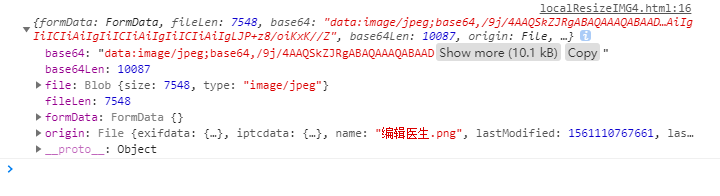
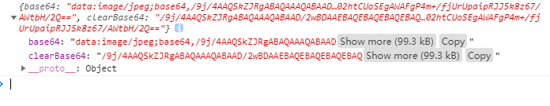

### 1. Html5使用localResizeIMG4压缩上传图片

在移动端应用中用户往往需要上传图片，但用户的图片一般都比较的大，对流量的消耗也随之变大，有时候需要进行压缩然后再进行上传图片，此时可以用到localResizeIMG4插件进行压缩并上传。

localResizeIMG4使用上存在这一些优势，比如经过了大量的测试，存在的bug较少，基于原生的JavaScript编写，支持AMD规范。

下载路径：

GitHub：https://github.com/think2011/localResizeIMG

NPM命令：npm install lrz

```js
$("input[type='file']").change(function(){lrz(file,[options]).then()});
```

参数

lrz(file, [options]);
- file 通过input:file得到文件，或者直接传入图片路径
- [options] 可选
  - width {Number} 图片最大不超过的宽度，默认为原图宽度，高度不设置时会适应宽度
  - height {Number} 图片高度
  - quality {Number} 图片压缩的质量 0~1， 值越小清晰度越小
  - fieldName {String} 后端接收的字段名
返回值

返回一个promise对象
- then(rst)
- rst.formData 后端可处理的数据
- rst.file 压缩后的file对象（默认已经丢在rst.formData有一份了），需要注意的是如果压缩率太低的话，这个会是原始的file对象
- rst.fileLen 生成后的图片的大小，后端可以通过此值来校验是否传输完整
- rst.base64 生成后的图片base64，后端可以处理此字符串为图片，也直接用于img.src = base64
- rst.base64Len 生成后的base64的大小，后端可以通过此值来校验是否传输完整 (如果采用base64上传方式)
- rst.origin 也就是原始的file对象，里面存了一些原始文件的信息，例如大小，日期等。
- catch(err)
- always()

lrz原理

基本原理是通过canvas渲染图片，再通过 toDataURL 方法压缩保存为base64字符串（能够编译为jpg格式的图片）

例子：

```html
<input type="file" accept="image/*" id="uploadIMG">

<script src="https://cdn.bootcdn.net/ajax/libs/jquery/1.10.0/jquery.js"></script>
<script src="./lrz.bundle.js"></script>
```
```js
$("input[type=file]").change(function(){
  lrz(this.files[0], {width: 400, quality: 0.8}).then(function(res){
    console.log(res);
    $("#IMG4").attr('src', res.base64);
  })
})
```


### 2. Html5使用localResizeIMG压缩上传图片

需要引入jQuery，引用LocalResizeIMG.js（插件主体）及mobileBUGFix.mini.js（移动端的补丁）

```html
<input type="file" name="localResizeIMG" multiple accept="image/*" id="localResizeIMG">

<script src="https://zhangshumiao.cn/cdn/jquery/jquery-1.10.0.js"></script>
<script src="https://zhangshumiao.cn/cdn/h5/localResizeIMG.js"></script>
<script src="https://zhangshumiao.cn/cdn/h5/mobileBUGFix.mini.js"></script>
```
```js
$("#localResizeIMG").localResizeIMG({
  width: 400,
  quality: 1, // 默认为1,1代表不压缩，值越小，压缩率越大，清晰度越小
  success: function(res) {
    console.log(res);
    // res.base64 带有base64的编码类型 可以直接赋值给img的src属性，显示图片
    // res.clearBase64 不带有base
    64的编码类型，可以不用截取类型直接发送给后台
  }
})
```
成功之后返回两个字段，分别是base64, clearBase64

