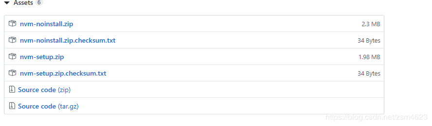
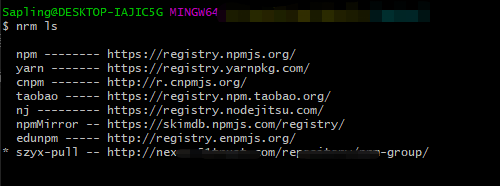

## 1. nvm

 1. nvm是什么
它是管理node版本的工具，一个电脑中可以安装多个node版本，当我们想使用哪个版本就切换成哪个版本，而nvm则是提供切换node版本的工具。

2. 下载
可以在github( https://github.com/coreybutler/nvm-windows/releases )中进行下载nvm 



nvm-noinstall.zip：绿色免安装版，但使用时需进行配置。

nvm-setup.zip：安装版，推荐使用

3. 管理node

查看本地安装的node所有版本；可选参数available，显示所有可下载的版本。 `nvm list[available]`

安装，指令中的版本号是可选参数，版本号可根据(1)查询出来 `nvm install12.3.0`

使用指定版本 `node nvmuse+版本号`

卸载指定版本 `node nvm uninstall+版本号`

4. 常见指令
nvm v 查看nvm版本号

nvm off 关闭管理node版本

nvm on 开启管理node版本

nvm arch 显示node运行在32位还是64位

nvm node_mirror[url] 设置node镜像。默认是https://nodejs.org/dist/。 如果不写url，则使用默认url。设置后可至安装目录settings.txt文件查看，也可直接在该文件操作。

nvm npm_mirror[url] 设置npm镜像。https://github.com/npm/cli/archive/。 如果不写url，则使用默认url。设置后可至安装目录settings.txt文件查看，也可直接在该文件操作。

nvm install<version>[arch] 安装node， version是特定版本也可以是最新稳定版本latest。可选参数arch指定安装32位还是64位版本，默认是系统位数。可以添加--insecure绕过远程服务器的SSL。

nvmuse[version][arch] 使用制定版本node。可指定32/64位。

注意：如果下载node时，比较慢可以修改下载镜像,打开安装路径中的setting文件,改成以下镜像

node_mirror: https://npm.taobao.org/mirrors/node/

npm_mirror: https://npm.taobao.org/mirrors/npm/

## 2. nrm 

1. nrm是一个npm源管理器，允许你快速的在npm源间切换

2. nrm 安装

```js
npm install -g nrm
```

3. nrm常见指令

nrm ls 查看可选源，列出所有可选择的源，标*代表当前使用的源



nrm current 查看当前使用的源，只会显示当前使用的源名

nrm use + 源名 切换源

nrm add <registry> <url> 添加源，`registry`为源名，`url`为源的地址

nrm del + 源名 删除源

nrm test + 源码 测试源速度(响应时间)

