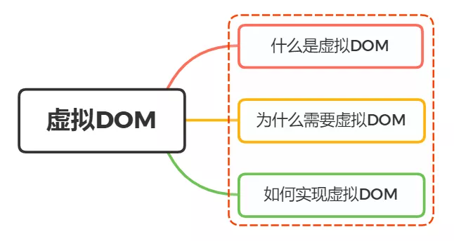
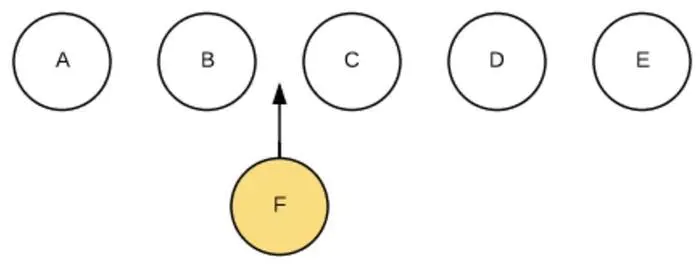
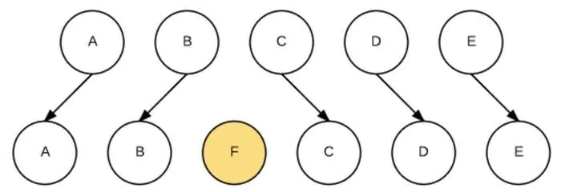

# Vue

### 1. Vue.nextTick()

1. 定义：在下次DOM更新循环结束之后执行的延迟回调。在修改数据之后立即使用这个方法，获取更新后的DOM

```js
add() {
  // this.count 初始化为1
  this.count += 1;
  console.log(this.$refs.count.innerText); // 1
  this.$nextTick(() => {
    console.log(this.$refs.count.innerText); // 2
  })
}
```
由此可以看出，当数据更新了，如果立即去获取DOM，其实获取到的值还是旧的，可以使用Vue.nextTick()去获取最新的DOM，如果想对数据更新后的
DOM去做一些操作，可使用Vue.nextTick()。

**简单的理解:** 就是将回调函数在下一次DOM更新之后再去调用，也就是当数据更新了，DOM渲染完毕后就会执行该函数。

2. 异步更新队列(nextTick原理)

Vue在更新DOM时是异步执行的，只要侦听到数据变化，Vue将开启一个队列，并缓冲在同一事件循环中发生的所有数据变更。如果同一个watcher
被多次触发，只会被推入到队列中一次，这种在缓冲时去除重复数据对于避免不必要的计算和DOM操作是非常重要的。而在下一个事件循环时，Vue会
清空队列，进行DOM的更新。

例如：当我们this.count = 1; DOM不会马上更新，而是在异步队列被清空后也就是下一个事件循环开始时才会DOM更新。此时如果你想根据更新的DOM
去做某些事情，就会发生问题的。为了在Vue数据变化后更新了DOM，可以在数据变化后使用Vue.nextTick()，这样回调事件将会在DOM更新后被调用。

3. 使用的场景

- 在Vue的created钩子函数中操作DOM时，因为在created中DOM还没有渲染，可以使用，也就相当于mounted函数
- 当数据更新后想基于DOM做一些事情后

案例1.  对于input的模糊搜索功能，当进行某个值搜索出来的结果展示时，如果超过一定高度，会出现滚动条，当把滚动条拉到底部时，
再进行一次搜索时此时数据更新了，但是滚动条还是在底部，没有滚到顶部，此时将数据的赋值操作放在Vue.nextTick()就能解决这个问题。

### 2. 深入响应式原理

当我们把一个普通的JavaScript对象传入Vue实例作为data选项，Vue将遍历此对象所有的property，并使用`Object.defineProperty`把这些
property全部转为getter/setter。但Object.defineProperty是ES5中一个无法shim的特性，所以对于ie8以及以下的浏览器不支持。

1) 对于对象

Vue无法检测property的添加和删除，由于Vue会在初始化实例时对property执行getter/setter转化，所以property必须在data对象上存在才能让Vue
将它转为响应式的。
```js
const example = Vue({
  data: {
    count: 1
  }
  // example.count 属于响应式的
  // example.b = 2  属于非响应式的
})
```
对于已经创建的实例，Vue 不需要动态添加属性，可以使用Vue.set(obj, key, value)  obj为对象名称， key是属性名，value是属性值。
```js
this.$set(obj, 'b', 2)
```
也可以使用Object.assign()
```js
this.someObject = Object.assign({}, this.someObject, { a: 1, b: 2 })
```
2) 对于数组

Vue不能检测以下数组的变化

1. 当使用索引设置一个值时，例如this.arr[0] = 1;

2. 当修改数组长度时，例如this.arr.length = 1;

对于第一种情况使用Vue.set()

对于第二种情况使用splice()方法

### 3. filter过滤器

在Vue中允许自定义过滤，一般用于一些文本的格式化，可以用在双花括号插值和v-bind表达式中。使用管道符号分隔。

filter函数第一个参数为管道符前面的值，后面的参数为传过来的参数,必须要有一个返回值return。

假如局部和全局过滤器名称相同时，会走局部过滤器。
```html
{{message | capitale(1)}}
<p :id="message | capitale"></p>
```

```js
// 局部组件
filters: {
  // val 代表message msg为传过来的参数，这里是1
  capitale(val, msg) {
    return val + msg;
  }
}
```
```js
// 全局过滤器
Vue.filter('capitale', (val, msg) => {
  return val + msg;
})
```
案例：在vue中使用全局filter进行封装

将所有的过滤器写在一个公共的JS文件中，在main.js全部导入使用
```js
import * as filters from './filters.js'
Object.keys(filters).forEach(key => {
  Vue.filter(key, filters[key]);
});
```
### 4. 导入与导出
[ES6导入与导出上](https://mp.weixin.qq.com/s/JgTU-fTi9Jo8Z8xa5Fm1Uw)

[ES6导入与导出下](https://mp.weixin.qq.com/s/QjXVGWAnJLJFbOzt81UoJw)

### 5. props(父传子)
- 类型： Array<string> | Object

- 作用： 父组件给子组件传值，数据只能单向传递不能流动，反之则不行，防止子组件去修改父组件的状态，并且由于父组件每次变更，props都
会进行刷新为最新的值，所以不能在子组件中直接去修改props值，可以先进行赋值给另一个值再去修改。

若修改有两种方法

1. 将传递过来的值赋给组件的data中的一个值

```js
props: ['num', 'count'],
data() {
  return{
    val: this.num
  }
}
```
2. 将传过来的值使用计算属性转化

```js
props: ['num'],
computed {
  val() {
    return this.num;
  }
}
```
- 详细

    props可以是数组也可以是对象，用来接收父组件传过来的值，对于对象来说可以配置高级选项，如默认值，数据类型。

    对于对象配置规则
    
    - type: 数据传过值的类型 `String`、`Array`、`Boolean`、`Object`、`Function`、`Number`
    - default: 为传过的值传入一个默认值，如果是数组和对象需要从一个工厂函数中返回 `default: () => {}`
    - required: 布尔类型，如果在开发环境子组件声明来了，但是父组件没有传过来则控制台会报错
    - validator: 函数，唯一的参数是prop传过的值。在开发环境中，如果检验的结果不符合则会报错，但也会显示出来，适用
    于开发时对数据的查看。

```js
Vue.component(
  'props-demo', {
    props: {
      height: Number,
      widths: {
        type: Array,
        default: () => {}
      },
      age: {
        type: Number,
        default: 0,
        required: true,
        validate(val) {
          return val > 1
        }
      } 
    }
  }
)
```

注意：
    - 对于一个prop可以有多个数据类型。比如：

```js
props: {
  height: [Number, String]
}
```

### 6. class与style动态设置

- class
    - 对象形式)

```css
.activeBg {
    background: skyblue;
  }
.activeFontSize {
font-size: 24px;
}
```

```html
<p :class="{ activeBg: isActiveBg, 'activeFontSize': isActiveFontSize }">class的对象形式</p>
```

```js
data: {
  isActiveBg: true,
  isActiveFontSize: true
}
```

对象形式时，可以直接使用`:`号分隔，左侧为类名，类名的存在取决于右侧的真假，类名可用引号引起来，也可以不引。多个类名时使用逗号分隔。
也是和普通的class共存。

在实际开发中，通常是遍历，类名会跟随index的值变化而变化，则可写成 `{activeBg: isActiveBg === index }`

也可以不直接写在行内，直接写在data中

```js
data: {
    obj: {
      activeBg: true,
      activeFontSize: true
    }
}
```

```html
<p :class="obj">class的对象形式</p>
```
当里面的`activeBg`和`activeFontSize`的值为真时，存在此类名否则不存在(这个字段名称和类名要一致)

在实际开发中， 可以通过改变这个值真假，来判断此类名是否存在。

再者也可以直接写在计算属性computed中

```js
classObj() {
    return {
      'activeBg': true
    }
},
```
```html
<p :class="classObj">class的对象形式</p>
```

在计算属性中书写时，左侧为类名，需要加引号，右侧为Boolean型。

- 不使用对象时

```html
<p :class="isActiveBg ? 'activeBg' : ''">class的对象形式</p>
```
使用三元表达式当`isActiveBg`为真时，类名`activeBg`存在，否则不存在。

- 数组语法

```html
<p :class="[isActiveBg, isActiveFontSize]">class的对象形式</p>
```

```js
data: {
  isActiveBg: 'axtiveBg',
  isActiveFontSize: 'activeFontSize'
}
```

也可以使用三元表达式
```html
<p :class="[isActiveBg ? 'axtiveBg' : '', isActiveFontSize]">class的对象形式</p>
```

也可以跟对象
```html
<p :class="[{axtiveBg: isActiveBg}, isActiveFontSize]">class的对象形式</p>
```

- style行内

```html
<div v-bind:style="{ color: activeColor, fontSize: fontSize + 'px' }"></div>
```
```js
data: {
  activeColor: 'red',
  fontSize: 30
}
```

也可以直接绑定一个样式对象

```html
<p :class="styleObj">class的对象形式</p>
```

```js
data: {
  styleObj: {
    color: 'red',
    fontSize: '30px'
  }
}
```
### 7. 虚拟DOM



1、什么是虚拟DOM

虚拟DOM其实是一层对真实DOM的抽象，以JavaScript对象的(VNode节点)作为基础的树，用对象的属性来描述节点，通过一系列操作将树映射到真实环境上。

在JavaScript中，虚拟DOM是一个对象形式的，最少要有三个属性，分别是标签名(tag)、属性(attrs)和子元素(chilren)属性。虚拟DOM就是为了更好的将虚拟的节点渲染到页面上去，所有虚拟DOM对象的节点是跟真实的DOM节点是一一对应的。

2、为什么会需要虚拟DOM

首先说DOM是慢的，并且元素非常庞大，其中页面的性能问题，大多是由DOM操作引起的，在一个DOM元素中，一个节点的会包括很多属性的。

对于传统的原生操作DOM或者jQuery操作DOM时，只要是一操作就会时页面元素从上到下都要执行一遍，哪怕只有一个元素新增了一个类名，都会重新走一遍，并且如果一个操作需要更新10DOM节点，则会执行10遍，因为浏览器并不知道后面还会要马上更新节点，也正因为这样用户凡是有一点的页面交互，DOM元素不断的刷新操作，如果过大的交互，就会造成页面的卡顿。而对于虚拟DOM来说会把这10次的更新存放到一个JS对象中，最终一次性更新到真实的DOM中。

虚拟DOM的特点：

- 减少DOM的操作。
- 跨平台渲染，不仅是浏览器，移动端，小程序都可以


虚拟DOM的实现使用了diff算法。

3、如何实现虚拟DOM

实现的原理：将要更新的虚拟DOM存放在一个js对象中，最后调用原生的createElement创建真实的DOM

**diff算法**

仅在同级的vnode间做diff，递归地进行同级vnode的diff，最终实现整个DOM树的更新。因为跨层级的操作是非常少的，忽略不计，这样时间复杂度就从O(n3)变成O(n)。

diff 算法包括几个步骤：

- 用 JavaScript 对象结构表示 DOM 树的结构；然后用这个树构建一个真正的 DOM 树，插到文档当中
- 当状态变更的时候，重新构造一棵新的对象树。然后用新的树和旧的树进行比较，记录两棵树差异
- 把所记录的差异应用到所构建的真正的DOM树上，视图就更新了


**diff 算法的两个核心函数实现过程**

- patch(container,vnode) :初次渲染的时候，将VDOM渲染成真正的DOM然后插入到容器里面。
- patch(vnode,newVnode):再次渲染的时候，将新的vnode和旧的vnode相对比，然后之间差异应用到所构建的真正的DOM树上。


1. patch(container,vnode)

通过这个函数可以让VNode渲染成真正的DOM，我们通过以下模拟代码，可以了解大致过程：

```js
function createElement(vnode) {    
var tag = vnode.tag  
var attrs = vnode.attrs || {}    
var children = vnode.children || []    
if (!tag) {       
 return null  
  }    
// 创建真实的 DOM 元素    
var elem = document.createElement(tag)   
 // 属性    
var attrName    
for (attrName in attrs) {    
    if (attrs.hasOwnProperty(attrName)) { 
           // 给 elem 添加属性
           elem.setAttribute(attrName, attrs[attrName])
        }
    }
    // 子元素
    children.forEach(function (childVnode) {
        // 给 elem 添加子元素，如果还有子节点，则递归的生成子节点。
        elem.appendChild(createElement(childVnode))  // 递归
    })    // 返回真实的 DOM 元素   
 return elem
}

```

2. patch(vnode,newVnode)

这里我们只考虑vnode与newVnode如何对比的情况：

```js
function updateChildren(vnode, newVnode) {
    var children = vnode.children || []
    var newChildren = newVnode.children || []
  // 遍历现有的children
    children.forEach(function (childVnode, index) {
        var newChildVnode = newChildren[index]
  // 两者tag一样
        if (childVnode.tag === newChildVnode.tag) {
            // 深层次对比，递归
            updateChildren(childVnode, newChildVnode)
        } else { 
  // 两者tag不一样
           replaceNode(childVnode, newChildVnode) 
       }
    }
)}

```

diff算法操作

会对新旧两颗树进行一个深度的遍历，每个节点都会有一个标记，每遍历一个到一个节点就把该节点和新的树进行比较，如果有差异就会记录到js对象中

我们创建一个新树，跟之前的旧树做比较

old tree
```js
const tree = Element('div', { id: 'virtual-container' }, [
    Element('p', {}, ['Virtual DOM']),
    Element('div', {}, ['before update']),
    Element('ul', {}, [
        Element('li', { class: 'item' }, ['Item 1']),
        Element('li', { class: 'item' }, ['Item 2']),
        Element('li', { class: 'item' }, ['Item 3']),
    ]),
]);

const root = tree.render();
document.getElementById('virtualDom').appendChild(root);
```

new tree

```js
const newTree = Element('div', { id: 'virtual-container' }, [
    Element('h3', {}, ['Virtual DOM']),                     // REPLACE
    Element('div', {}, ['after update']),                   // TEXT
    Element('ul', { class: 'marginLeft10' }, [              // PROPS
        Element('li', { class: 'item' }, ['Item 1']),
        // Element('li', { class: 'item' }, ['Item 2']),    // REORDER remove
        Element('li', { class: 'item' }, ['Item 3']),
    ]),
]);
```

平层Diff，只有以下4种情况：

1、节点类型变了，例如下图中的P变成了H3。我们将这个过程称之为REPLACE。直接将旧节点卸载并装载新节点。旧节点包括下面的子节点都将被卸载，如果新节点和旧节点仅仅是类型不同，但下面的所有子节点都一样时，这样做效率不高。但为了避免O(n^3)的时间复杂度，这样是值得的。这也提醒了开发者，应该避免无谓的节点类型的变化，例如运行时将div变成p没有意义。

2、节点类型一样，仅仅属性或属性值变了。我们将这个过程称之为PROPS。此时不会触发节点卸载和装载，而是节点更新。
```js
function diffProps(oldNode, newNode) {
    const oldProps = oldNode.props;
    const newProps = newNode.props;

    let key;
    const propsPatches = {};
    let isSame = true;

    // find out different props
    for (key in oldProps) {
        if (newProps[key] !== oldProps[key]) {
            isSame = false;
            propsPatches[key] = newProps[key];
        }
    }

    // find out new props
    for (key in newProps) {
        if (!oldProps.hasOwnProperty(key)) {
            isSame = false;
            propsPatches[key] = newProps[key];
        }
    }

    return isSame ? null : propsPatches;
}
```
3、文本变了，文本对也是一个Text Node，也比较简单，直接修改文字内容就行了，我们将这个过程称之为TEXT。

4、移动／增加／删除 子节点，我们将这个过程称之为REORDER。看一个例子，在A、B、C、D、E五个节点的B和C中的BC两个节点中间加入一个F节点。

例子：



我们简单粗暴的做法是遍历每一个新虚拟DOM的节点，与旧虚拟DOM对比相应节点对比，在旧DOM中是否存在，不同就卸载原来的按上新的。这样会对F后边每一个节点进行操作。卸载C，装载F，卸载D，装载C，卸载E，装载D，装载E。效率太低。


如果我们在JSX里为数组或枚举型元素增加上key后，它能够根据key，直接找到具体位置进行操作，效率比较高。常见的最小编辑距离问题，可以用Levenshtein Distance算法来实现，时间复杂度是O(M*N)，但通常我们只要一些简单的移动就能满足需要，降低精确性，将时间复杂度降低到O(max(M,N))即可。


**Vue 中的虚拟DOM**

模板转换成视图的过程

- Vue.js通过编译将template 模板转换成渲染函数(render ) ，执行渲染函数就可以得到一个虚拟节点树
- 在对 Model 进行操作的时候，会触发对应 Dep 中的 Watcher 对象。Watcher 对象会调用对应的 update 来修改视图。这个过程主要是将新旧虚拟节点进行差异对比，然后根据对比结果进行DOM操作来更新视图。

简单点讲，在Vue的底层实现上，Vue将模板编译成虚拟DOM渲染函数。结合Vue自带的响应系统，在状态改变时，Vue能够智能地计算出重新渲染组件的最小代价并应到DOM操作上。  


借鉴：


https://blog.csdn.net/fundebug/article/details/93715457

https://www.jianshu.com/p/af0b398602bc